# Week 4: Interpretable Machine Learning for Data Science

**Problem**: You have been mandated by a large wine-making company in Valais to discover the key chemical factors that determine the quality of wine and build an interpretable model that will help their cellar masters make decisions daily.

## Settings things up


```python
import numpy as np
import pandas as pd
import seaborn as sns
import shap
import sklearn
import matplotlib.pyplot as plt
```

    /home/lia/Desktop/HES/Semestre_5/ML/w4-isc-ml-Eteroclia/venv/lib/python3.12/site-packages/tqdm/auto.py:21: TqdmWarning: IProgress not found. Please update jupyter and ipywidgets. See https://ipywidgets.readthedocs.io/en/stable/user_install.html
      from .autonotebook import tqdm as notebook_tqdm


## Fetch the data


We fetch the dataset using it's id (186)


```python
from ucimlrepo import list_available_datasets,fetch_ucirepo

# fetch dataset 
wine_quality = fetch_ucirepo(id=186) 
  

```

We check the dataset to see what it contains.


```python
# metadata 
print(wine_quality.metadata) 
  
# variable information 
print(wine_quality.variables) 
```

    {'uci_id': 186, 'name': 'Wine Quality', 'repository_url': 'https://archive.ics.uci.edu/dataset/186/wine+quality', 'data_url': 'https://archive.ics.uci.edu/static/public/186/data.csv', 'abstract': 'Two datasets are included, related to red and white vinho verde wine samples, from the north of Portugal. The goal is to model wine quality based on physicochemical tests (see [Cortez et al., 2009], http://www3.dsi.uminho.pt/pcortez/wine/).', 'area': 'Business', 'tasks': ['Classification', 'Regression'], 'characteristics': ['Multivariate'], 'num_instances': 4898, 'num_features': 11, 'feature_types': ['Real'], 'demographics': [], 'target_col': ['quality'], 'index_col': None, 'has_missing_values': 'no', 'missing_values_symbol': None, 'year_of_dataset_creation': 2009, 'last_updated': 'Wed Nov 15 2023', 'dataset_doi': '10.24432/C56S3T', 'creators': ['Paulo Cortez', 'A. Cerdeira', 'F. Almeida', 'T. Matos', 'J. Reis'], 'intro_paper': {'ID': 252, 'type': 'NATIVE', 'title': 'Modeling wine preferences by data mining from physicochemical properties', 'authors': 'P. Cortez, A. Cerdeira, Fernando Almeida, Telmo Matos, J. Reis', 'venue': 'Decision Support Systems', 'year': 2009, 'journal': None, 'DOI': None, 'URL': 'https://www.semanticscholar.org/paper/Modeling-wine-preferences-by-data-mining-from-Cortez-Cerdeira/bf15a0ccc14ac1deb5cea570c870389c16be019c', 'sha': None, 'corpus': None, 'arxiv': None, 'mag': None, 'acl': None, 'pmid': None, 'pmcid': None}, 'additional_info': {'summary': 'The two datasets are related to red and white variants of the Portuguese "Vinho Verde" wine. For more details, consult: http://www.vinhoverde.pt/en/ or the reference [Cortez et al., 2009].  Due to privacy and logistic issues, only physicochemical (inputs) and sensory (the output) variables are available (e.g. there is no data about grape types, wine brand, wine selling price, etc.).\n\nThese datasets can be viewed as classification or regression tasks.  The classes are ordered and not balanced (e.g. there are many more normal wines than excellent or poor ones). Outlier detection algorithms could be used to detect the few excellent or poor wines. Also, we are not sure if all input variables are relevant. So it could be interesting to test feature selection methods.\n', 'purpose': None, 'funded_by': None, 'instances_represent': None, 'recommended_data_splits': None, 'sensitive_data': None, 'preprocessing_description': None, 'variable_info': 'For more information, read [Cortez et al., 2009].\r\nInput variables (based on physicochemical tests):\r\n   1 - fixed acidity\r\n   2 - volatile acidity\r\n   3 - citric acid\r\n   4 - residual sugar\r\n   5 - chlorides\r\n   6 - free sulfur dioxide\r\n   7 - total sulfur dioxide\r\n   8 - density\r\n   9 - pH\r\n   10 - sulphates\r\n   11 - alcohol\r\nOutput variable (based on sensory data): \r\n   12 - quality (score between 0 and 10)', 'citation': None}}
                        name     role         type demographic  \
    0          fixed_acidity  Feature   Continuous        None   
    1       volatile_acidity  Feature   Continuous        None   
    2            citric_acid  Feature   Continuous        None   
    3         residual_sugar  Feature   Continuous        None   
    4              chlorides  Feature   Continuous        None   
    5    free_sulfur_dioxide  Feature   Continuous        None   
    6   total_sulfur_dioxide  Feature   Continuous        None   
    7                density  Feature   Continuous        None   
    8                     pH  Feature   Continuous        None   
    9              sulphates  Feature   Continuous        None   
    10               alcohol  Feature   Continuous        None   
    11               quality   Target      Integer        None   
    12                 color    Other  Categorical        None   
    
                   description units missing_values  
    0                     None  None             no  
    1                     None  None             no  
    2                     None  None             no  
    3                     None  None             no  
    4                     None  None             no  
    5                     None  None             no  
    6                     None  None             no  
    7                     None  None             no  
    8                     None  None             no  
    9                     None  None             no  
    10                    None  None             no  
    11  score between 0 and 10  None             no  
    12            red or white  None             no  


We split the set into a X (the features) and y (the wanted values)


```python
# data (as pandas dataframes) 

y = wine_quality.data.targets 
o = wine_quality.data.original
```


```python
X=o.drop("quality", axis=1)
```

Now, let's check that the data have the correct shape to ensure they have been loaded as expected.

Calculate how many samples and features we have in total, how many are red or white wines, how many are good or bad wines, etc.


```python
X.describe()
```


<div>
<style scoped>
    .dataframe tbody tr th:only-of-type {
        vertical-align: middle;
    }

    .dataframe tbody tr th {
        vertical-align: top;
    }

    .dataframe thead th {
        text-align: right;
    }
</style>
<table border="1" class="dataframe">
  <thead>
    <tr style="text-align: right;">
      <th></th>
      <th>fixed_acidity</th>
      <th>volatile_acidity</th>
      <th>citric_acid</th>
      <th>residual_sugar</th>
      <th>chlorides</th>
      <th>free_sulfur_dioxide</th>
      <th>total_sulfur_dioxide</th>
      <th>density</th>
      <th>pH</th>
      <th>sulphates</th>
      <th>alcohol</th>
    </tr>
  </thead>
  <tbody>
    <tr>
      <th>count</th>
      <td>6497.000000</td>
      <td>6497.000000</td>
      <td>6497.000000</td>
      <td>6497.000000</td>
      <td>6497.000000</td>
      <td>6497.000000</td>
      <td>6497.000000</td>
      <td>6497.000000</td>
      <td>6497.000000</td>
      <td>6497.000000</td>
      <td>6497.000000</td>
    </tr>
    <tr>
      <th>mean</th>
      <td>7.215307</td>
      <td>0.339666</td>
      <td>0.318633</td>
      <td>5.443235</td>
      <td>0.056034</td>
      <td>30.525319</td>
      <td>115.744574</td>
      <td>0.994697</td>
      <td>3.218501</td>
      <td>0.531268</td>
      <td>10.491801</td>
    </tr>
    <tr>
      <th>std</th>
      <td>1.296434</td>
      <td>0.164636</td>
      <td>0.145318</td>
      <td>4.757804</td>
      <td>0.035034</td>
      <td>17.749400</td>
      <td>56.521855</td>
      <td>0.002999</td>
      <td>0.160787</td>
      <td>0.148806</td>
      <td>1.192712</td>
    </tr>
    <tr>
      <th>min</th>
      <td>3.800000</td>
      <td>0.080000</td>
      <td>0.000000</td>
      <td>0.600000</td>
      <td>0.009000</td>
      <td>1.000000</td>
      <td>6.000000</td>
      <td>0.987110</td>
      <td>2.720000</td>
      <td>0.220000</td>
      <td>8.000000</td>
    </tr>
    <tr>
      <th>25%</th>
      <td>6.400000</td>
      <td>0.230000</td>
      <td>0.250000</td>
      <td>1.800000</td>
      <td>0.038000</td>
      <td>17.000000</td>
      <td>77.000000</td>
      <td>0.992340</td>
      <td>3.110000</td>
      <td>0.430000</td>
      <td>9.500000</td>
    </tr>
    <tr>
      <th>50%</th>
      <td>7.000000</td>
      <td>0.290000</td>
      <td>0.310000</td>
      <td>3.000000</td>
      <td>0.047000</td>
      <td>29.000000</td>
      <td>118.000000</td>
      <td>0.994890</td>
      <td>3.210000</td>
      <td>0.510000</td>
      <td>10.300000</td>
    </tr>
    <tr>
      <th>75%</th>
      <td>7.700000</td>
      <td>0.400000</td>
      <td>0.390000</td>
      <td>8.100000</td>
      <td>0.065000</td>
      <td>41.000000</td>
      <td>156.000000</td>
      <td>0.996990</td>
      <td>3.320000</td>
      <td>0.600000</td>
      <td>11.300000</td>
    </tr>
    <tr>
      <th>max</th>
      <td>15.900000</td>
      <td>1.580000</td>
      <td>1.660000</td>
      <td>65.800000</td>
      <td>0.611000</td>
      <td>289.000000</td>
      <td>440.000000</td>
      <td>1.038980</td>
      <td>4.010000</td>
      <td>2.000000</td>
      <td>14.900000</td>
    </tr>
  </tbody>
</table>
</div>


```python
X.info()
```

    <class 'pandas.core.frame.DataFrame'>
    RangeIndex: 6497 entries, 0 to 6496
    Data columns (total 12 columns):
     #   Column                Non-Null Count  Dtype  
    ---  ------                --------------  -----  
     0   fixed_acidity         6497 non-null   float64
     1   volatile_acidity      6497 non-null   float64
     2   citric_acid           6497 non-null   float64
     3   residual_sugar        6497 non-null   float64
     4   chlorides             6497 non-null   float64
     5   free_sulfur_dioxide   6497 non-null   float64
     6   total_sulfur_dioxide  6497 non-null   float64
     7   density               6497 non-null   float64
     8   pH                    6497 non-null   float64
     9   sulphates             6497 non-null   float64
     10  alcohol               6497 non-null   float64
     11  color                 6497 non-null   object 
    dtypes: float64(11), object(1)
    memory usage: 609.2+ KB


```python
print(f'number of white wine: {X[X["color"]=="white"]["color"].count()}')
```

    number of white wine: 4898


## Data Exploration

We now will inspect the features one-by-one, and try to understand their dynamics, especially between white and red wines.

Split the set between white and red.


```python
X_white=X[X["color"]=="white"].drop("color",axis=1)
X_white.describe()
```


<div>
<style scoped>
    .dataframe tbody tr th:only-of-type {
        vertical-align: middle;
    }

    .dataframe tbody tr th {
        vertical-align: top;
    }

    .dataframe thead th {
        text-align: right;
    }
</style>
<table border="1" class="dataframe">
  <thead>
    <tr style="text-align: right;">
      <th></th>
      <th>fixed_acidity</th>
      <th>volatile_acidity</th>
      <th>citric_acid</th>
      <th>residual_sugar</th>
      <th>chlorides</th>
      <th>free_sulfur_dioxide</th>
      <th>total_sulfur_dioxide</th>
      <th>density</th>
      <th>pH</th>
      <th>sulphates</th>
      <th>alcohol</th>
    </tr>
  </thead>
  <tbody>
    <tr>
      <th>count</th>
      <td>4898.000000</td>
      <td>4898.000000</td>
      <td>4898.000000</td>
      <td>4898.000000</td>
      <td>4898.000000</td>
      <td>4898.000000</td>
      <td>4898.000000</td>
      <td>4898.000000</td>
      <td>4898.000000</td>
      <td>4898.000000</td>
      <td>4898.000000</td>
    </tr>
    <tr>
      <th>mean</th>
      <td>6.854788</td>
      <td>0.278241</td>
      <td>0.334192</td>
      <td>6.391415</td>
      <td>0.045772</td>
      <td>35.308085</td>
      <td>138.360657</td>
      <td>0.994027</td>
      <td>3.188267</td>
      <td>0.489847</td>
      <td>10.514267</td>
    </tr>
    <tr>
      <th>std</th>
      <td>0.843868</td>
      <td>0.100795</td>
      <td>0.121020</td>
      <td>5.072058</td>
      <td>0.021848</td>
      <td>17.007137</td>
      <td>42.498065</td>
      <td>0.002991</td>
      <td>0.151001</td>
      <td>0.114126</td>
      <td>1.230621</td>
    </tr>
    <tr>
      <th>min</th>
      <td>3.800000</td>
      <td>0.080000</td>
      <td>0.000000</td>
      <td>0.600000</td>
      <td>0.009000</td>
      <td>2.000000</td>
      <td>9.000000</td>
      <td>0.987110</td>
      <td>2.720000</td>
      <td>0.220000</td>
      <td>8.000000</td>
    </tr>
    <tr>
      <th>25%</th>
      <td>6.300000</td>
      <td>0.210000</td>
      <td>0.270000</td>
      <td>1.700000</td>
      <td>0.036000</td>
      <td>23.000000</td>
      <td>108.000000</td>
      <td>0.991723</td>
      <td>3.090000</td>
      <td>0.410000</td>
      <td>9.500000</td>
    </tr>
    <tr>
      <th>50%</th>
      <td>6.800000</td>
      <td>0.260000</td>
      <td>0.320000</td>
      <td>5.200000</td>
      <td>0.043000</td>
      <td>34.000000</td>
      <td>134.000000</td>
      <td>0.993740</td>
      <td>3.180000</td>
      <td>0.470000</td>
      <td>10.400000</td>
    </tr>
    <tr>
      <th>75%</th>
      <td>7.300000</td>
      <td>0.320000</td>
      <td>0.390000</td>
      <td>9.900000</td>
      <td>0.050000</td>
      <td>46.000000</td>
      <td>167.000000</td>
      <td>0.996100</td>
      <td>3.280000</td>
      <td>0.550000</td>
      <td>11.400000</td>
    </tr>
    <tr>
      <th>max</th>
      <td>14.200000</td>
      <td>1.100000</td>
      <td>1.660000</td>
      <td>65.800000</td>
      <td>0.346000</td>
      <td>289.000000</td>
      <td>440.000000</td>
      <td>1.038980</td>
      <td>3.820000</td>
      <td>1.080000</td>
      <td>14.200000</td>
    </tr>
  </tbody>
</table>
</div>


```python
X_red=X[X["color"]=="red"].drop("color",axis=1)
X_red.describe()
```


<div>
<style scoped>
    .dataframe tbody tr th:only-of-type {
        vertical-align: middle;
    }

    .dataframe tbody tr th {
        vertical-align: top;
    }

    .dataframe thead th {
        text-align: right;
    }
</style>
<table border="1" class="dataframe">
  <thead>
    <tr style="text-align: right;">
      <th></th>
      <th>fixed_acidity</th>
      <th>volatile_acidity</th>
      <th>citric_acid</th>
      <th>residual_sugar</th>
      <th>chlorides</th>
      <th>free_sulfur_dioxide</th>
      <th>total_sulfur_dioxide</th>
      <th>density</th>
      <th>pH</th>
      <th>sulphates</th>
      <th>alcohol</th>
    </tr>
  </thead>
  <tbody>
    <tr>
      <th>count</th>
      <td>1599.000000</td>
      <td>1599.000000</td>
      <td>1599.000000</td>
      <td>1599.000000</td>
      <td>1599.000000</td>
      <td>1599.000000</td>
      <td>1599.000000</td>
      <td>1599.000000</td>
      <td>1599.000000</td>
      <td>1599.000000</td>
      <td>1599.000000</td>
    </tr>
    <tr>
      <th>mean</th>
      <td>8.319637</td>
      <td>0.527821</td>
      <td>0.270976</td>
      <td>2.538806</td>
      <td>0.087467</td>
      <td>15.874922</td>
      <td>46.467792</td>
      <td>0.996747</td>
      <td>3.311113</td>
      <td>0.658149</td>
      <td>10.422983</td>
    </tr>
    <tr>
      <th>std</th>
      <td>1.741096</td>
      <td>0.179060</td>
      <td>0.194801</td>
      <td>1.409928</td>
      <td>0.047065</td>
      <td>10.460157</td>
      <td>32.895324</td>
      <td>0.001887</td>
      <td>0.154386</td>
      <td>0.169507</td>
      <td>1.065668</td>
    </tr>
    <tr>
      <th>min</th>
      <td>4.600000</td>
      <td>0.120000</td>
      <td>0.000000</td>
      <td>0.900000</td>
      <td>0.012000</td>
      <td>1.000000</td>
      <td>6.000000</td>
      <td>0.990070</td>
      <td>2.740000</td>
      <td>0.330000</td>
      <td>8.400000</td>
    </tr>
    <tr>
      <th>25%</th>
      <td>7.100000</td>
      <td>0.390000</td>
      <td>0.090000</td>
      <td>1.900000</td>
      <td>0.070000</td>
      <td>7.000000</td>
      <td>22.000000</td>
      <td>0.995600</td>
      <td>3.210000</td>
      <td>0.550000</td>
      <td>9.500000</td>
    </tr>
    <tr>
      <th>50%</th>
      <td>7.900000</td>
      <td>0.520000</td>
      <td>0.260000</td>
      <td>2.200000</td>
      <td>0.079000</td>
      <td>14.000000</td>
      <td>38.000000</td>
      <td>0.996750</td>
      <td>3.310000</td>
      <td>0.620000</td>
      <td>10.200000</td>
    </tr>
    <tr>
      <th>75%</th>
      <td>9.200000</td>
      <td>0.640000</td>
      <td>0.420000</td>
      <td>2.600000</td>
      <td>0.090000</td>
      <td>21.000000</td>
      <td>62.000000</td>
      <td>0.997835</td>
      <td>3.400000</td>
      <td>0.730000</td>
      <td>11.100000</td>
    </tr>
    <tr>
      <th>max</th>
      <td>15.900000</td>
      <td>1.580000</td>
      <td>1.000000</td>
      <td>15.500000</td>
      <td>0.611000</td>
      <td>72.000000</td>
      <td>289.000000</td>
      <td>1.003690</td>
      <td>4.010000</td>
      <td>2.000000</td>
      <td>14.900000</td>
    </tr>
  </tbody>
</table>
</div>


We plot each feature in a set white/red to compare their values. 


```python
fig, axes = plt.subplots(4, 3, figsize=(18, 10))
# Create the violin plot
sns.violinplot(ax=axes[0, 0],x='color', y='fixed_acidity', data=X)
sns.violinplot(ax=axes[0, 1],x='color', y='volatile_acidity', data=X)
sns.violinplot(ax=axes[0, 2],x='color', y='citric_acid', data=X)
sns.violinplot(ax=axes[1, 0],x='color', y='residual_sugar', data=X)
sns.violinplot(ax=axes[1, 1],x='color', y='chlorides', data=X)
sns.violinplot(ax=axes[1, 2],x='color', y='free_sulfur_dioxide', data=X)
sns.violinplot(ax=axes[2, 0],x='color', y='total_sulfur_dioxide', data=X)
sns.violinplot(ax=axes[2, 1],x='color', y='density', data=X)
sns.violinplot(ax=axes[2, 2],x='color', y='pH', data=X)
sns.violinplot(ax=axes[3, 0],x='color', y='sulphates', data=X)
sns.violinplot(ax=axes[3, 1],x='color', y='alcohol', data=X)


# Display the plot
#plt.show()
```


    <Axes: xlabel='color', ylabel='alcohol'>


    
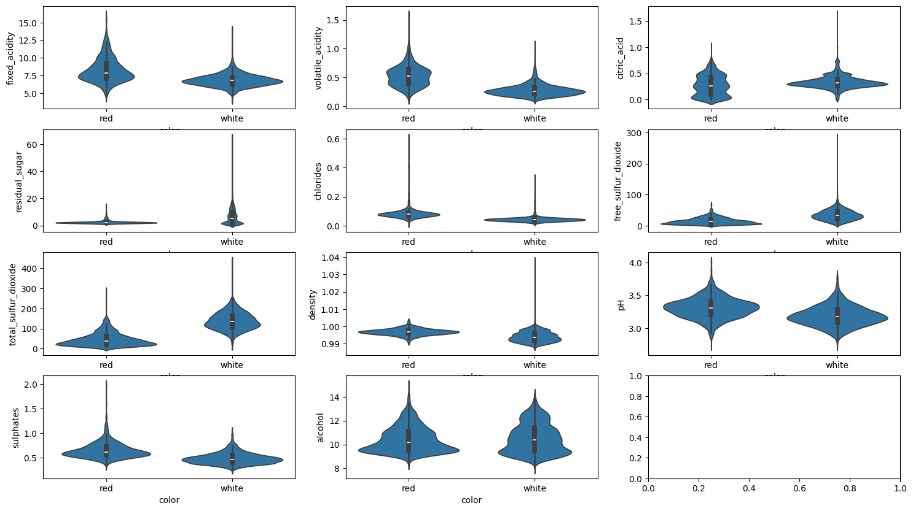
    


We can see where the values are similar and where they aren't. For exemple acidity is different but ph is fairly similar.

It also mean that we should be able to separate the color of a wine based on chemical properties.

We will then plot the correlation between all these features to see if some should/could be removed.


```python
fig, ax = plt.subplots(nrows=1, ncols=2)


ax[0].matshow(X[X["color"]=="white"].drop("color",axis=1).corr(method='pearson'))

ax[0].set_xticks(labels=list(X.drop("color",axis=1)),ticks=range(0,11),rotation=90,ha="left")
ax[0].set_yticks(labels=list(X.drop("color",axis=1)),ticks=range(0,11))
ax[0].set_title("white wine correlation matrix")


ax[1].matshow(X[X["color"]=="red"].drop("color",axis=1).corr(method='pearson'))
ax[1].set_xticks(labels=list(X.drop("color",axis=1)),ticks=range(0,11),rotation=90,ha="left")
ax[1].set_yticks(labels=list(),ticks=range(0,11))
ax[1].set_title("red wine correlation matrix")

plt.show()

```


    
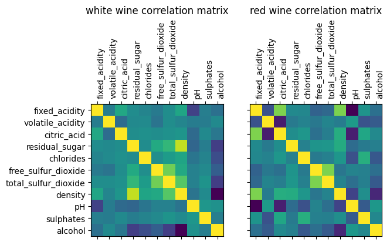
    


There is no correlation that is high enough to be worth removing features.

## Data Exploration using Unsupervised Learning

We first explore the data in an unsupervised fashion. Start by creating a heatmap of the average feature value for red and white wines. Can you spot an easy way to differentiate between reds and whites?


```python
X_red_mean=X_red.mean()
X_white_mean=X_white.mean()
res=pd.DataFrame({"white":X_white_mean,"Red":X_red_mean})
plt.matshow(res.transpose())
plt.xticks(labels=list(X.drop("color",axis=1)),ticks=range(0,11),rotation=45)
plt.yticks(labels=["White","Red"],ticks=[0,1])
plt.show()
```


    
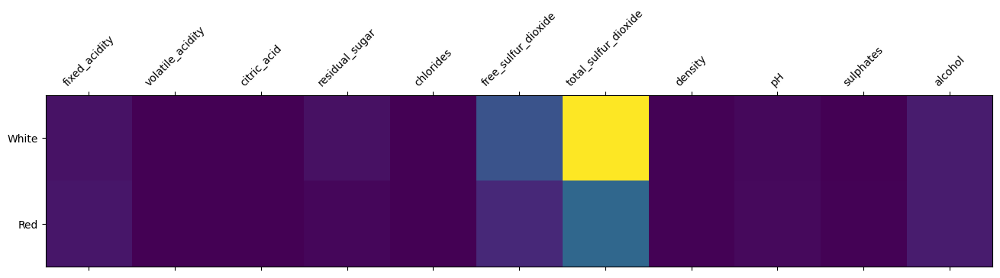
    


While not foolproof, we can see that white wine has a higher average sulfur dioxide concentration, wich will help differentiate the colors.


```python
from sklearn.preprocessing import RobustScaler

```

### Using PCA to reduce the dimensionality

We scale the data on the whole (combined) set before going further.


```python
scaler=RobustScaler()
labels=X["color"]
rescaled_X=pd.DataFrame(scaler.fit_transform(X.drop("color",axis=1)),columns=list(X)[:-1])
rescaled_X=rescaled_X.join(labels)
rescaled_X
```


<div>
<style scoped>
    .dataframe tbody tr th:only-of-type {
        vertical-align: middle;
    }

    .dataframe tbody tr th {
        vertical-align: top;
    }

    .dataframe thead th {
        text-align: right;
    }
</style>
<table border="1" class="dataframe">
  <thead>
    <tr style="text-align: right;">
      <th></th>
      <th>fixed_acidity</th>
      <th>volatile_acidity</th>
      <th>citric_acid</th>
      <th>residual_sugar</th>
      <th>chlorides</th>
      <th>free_sulfur_dioxide</th>
      <th>total_sulfur_dioxide</th>
      <th>density</th>
      <th>pH</th>
      <th>sulphates</th>
      <th>alcohol</th>
      <th>color</th>
    </tr>
  </thead>
  <tbody>
    <tr>
      <th>0</th>
      <td>0.307692</td>
      <td>2.411765</td>
      <td>-2.214286</td>
      <td>-0.174603</td>
      <td>1.074074</td>
      <td>-0.750000</td>
      <td>-1.063291</td>
      <td>0.625806</td>
      <td>1.428571</td>
      <td>0.294118</td>
      <td>-0.500000</td>
      <td>red</td>
    </tr>
    <tr>
      <th>1</th>
      <td>0.615385</td>
      <td>3.470588</td>
      <td>-2.214286</td>
      <td>-0.063492</td>
      <td>1.888889</td>
      <td>-0.166667</td>
      <td>-0.645570</td>
      <td>0.410753</td>
      <td>-0.047619</td>
      <td>1.000000</td>
      <td>-0.277778</td>
      <td>red</td>
    </tr>
    <tr>
      <th>2</th>
      <td>0.615385</td>
      <td>2.764706</td>
      <td>-1.928571</td>
      <td>-0.111111</td>
      <td>1.666667</td>
      <td>-0.583333</td>
      <td>-0.810127</td>
      <td>0.453763</td>
      <td>0.238095</td>
      <td>0.823529</td>
      <td>-0.277778</td>
      <td>red</td>
    </tr>
    <tr>
      <th>3</th>
      <td>3.230769</td>
      <td>-0.058824</td>
      <td>1.785714</td>
      <td>-0.174603</td>
      <td>1.037037</td>
      <td>-0.500000</td>
      <td>-0.734177</td>
      <td>0.668817</td>
      <td>-0.238095</td>
      <td>0.411765</td>
      <td>-0.277778</td>
      <td>red</td>
    </tr>
    <tr>
      <th>4</th>
      <td>0.307692</td>
      <td>2.411765</td>
      <td>-2.214286</td>
      <td>-0.174603</td>
      <td>1.074074</td>
      <td>-0.750000</td>
      <td>-1.063291</td>
      <td>0.625806</td>
      <td>1.428571</td>
      <td>0.294118</td>
      <td>-0.500000</td>
      <td>red</td>
    </tr>
    <tr>
      <th>...</th>
      <td>...</td>
      <td>...</td>
      <td>...</td>
      <td>...</td>
      <td>...</td>
      <td>...</td>
      <td>...</td>
      <td>...</td>
      <td>...</td>
      <td>...</td>
      <td>...</td>
      <td>...</td>
    </tr>
    <tr>
      <th>6492</th>
      <td>-0.615385</td>
      <td>-0.470588</td>
      <td>-0.142857</td>
      <td>-0.222222</td>
      <td>-0.296296</td>
      <td>-0.208333</td>
      <td>-0.329114</td>
      <td>-0.806452</td>
      <td>0.285714</td>
      <td>-0.058824</td>
      <td>0.500000</td>
      <td>white</td>
    </tr>
    <tr>
      <th>6493</th>
      <td>-0.307692</td>
      <td>0.176471</td>
      <td>0.357143</td>
      <td>0.793651</td>
      <td>0.000000</td>
      <td>1.166667</td>
      <td>0.632911</td>
      <td>0.002151</td>
      <td>-0.285714</td>
      <td>-0.294118</td>
      <td>-0.388889</td>
      <td>white</td>
    </tr>
    <tr>
      <th>6494</th>
      <td>-0.384615</td>
      <td>-0.294118</td>
      <td>-0.857143</td>
      <td>-0.285714</td>
      <td>-0.222222</td>
      <td>0.041667</td>
      <td>-0.088608</td>
      <td>-0.505376</td>
      <td>-1.047619</td>
      <td>-0.294118</td>
      <td>-0.500000</td>
      <td>white</td>
    </tr>
    <tr>
      <th>6495</th>
      <td>-1.153846</td>
      <td>0.000000</td>
      <td>-0.071429</td>
      <td>-0.301587</td>
      <td>-0.925926</td>
      <td>-0.375000</td>
      <td>-0.101266</td>
      <td>-1.333333</td>
      <td>0.619048</td>
      <td>-0.764706</td>
      <td>1.388889</td>
      <td>white</td>
    </tr>
    <tr>
      <th>6496</th>
      <td>-0.769231</td>
      <td>-0.470588</td>
      <td>0.500000</td>
      <td>-0.349206</td>
      <td>-1.000000</td>
      <td>-0.291667</td>
      <td>-0.253165</td>
      <td>-1.178495</td>
      <td>0.238095</td>
      <td>-1.117647</td>
      <td>0.833333</td>
      <td>white</td>
    </tr>
  </tbody>
</table>
<p>6497 rows × 12 columns</p>
</div>


```python
import plotly.express as px
from sklearn.decomposition import PCA
```

We plot multiple PCA set to see different possiblities.


```python

pca = PCA()
components = pca.fit_transform(rescaled_X[list(rescaled_X)[:-1]])
labels = {
    str(i): f'PC {i+1} ({var:.1f}%)'
    for i, var in enumerate(pca.explained_variance_ratio_ * 100)
}

fig = px.scatter_matrix(
    components,
    labels=labels,
    dimensions=range(4),
    color=rescaled_X["color"],
)
fig.update_traces(diagonal_visible=False)
fig.show()
```


We can see how good the separation is for each PCA.

We will now run a normal PCA wich will find the best separation possible.


```python


pca = PCA(n_components=2)
components = pca.fit_transform(rescaled_X[list(rescaled_X)[:-1]])

fig = px.scatter(components, x=0, y=1, color=rescaled_X['color'])
fig.show()
```


Here we can see that we do indeed have a pretty good separation between red and white wine.

### Cluster the data in 2-dimensional space


We will now use a kmean clustering algorithme as a first algorithme to see how good a separation it can obtain.


```python
from sklearn.cluster import KMeans
from sklearn.model_selection import cross_validate
```


```python
kmeans = KMeans(n_clusters=2)
kmeans.fit(components)
centers=kmeans.cluster_centers_
```


```python
colors=list(map(lambda x : "Blue" if x=="white" else "Red",X["color"]))
figs, ax = plt.subplots(1,2,figsize=(10,5))
ax[0].scatter(components[:,0],components[:,1],c=colors,s=10)
ax[0].scatter(centers[:,0],centers[:,1],c=["Pink","Cyan"])

ax[1].scatter(components[:,0],components[:,1],c=kmeans.predict(components),s=10)
ax[1].scatter(centers[:,0],centers[:,1],c=["Pink","Cyan"])
plt.show()

```


    
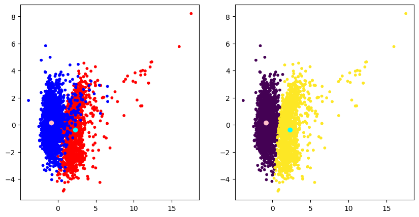
    


We can see the PCA on the left with the centers of the clusters in pink and cyan, and the kmeans result on the right. We can see some misclasification, but we will calculate multiple scores to be sure.


```python
from sklearn.utils import shuffle
```


```python
shuffled_X=shuffle(rescaled_X).reset_index(drop=True)
scores=cross_validate(kmeans, shuffled_X.drop("color",axis=1),shuffled_X["color"].map(lambda x: 1 if x=="red" else 0) , cv=10,scoring=["accuracy","f1_weighted","adjusted_mutual_info_score"])

print(scores["test_accuracy"])
print(scores["test_f1_weighted"])
print(scores["test_adjusted_mutual_info_score"])
```

    [0.98307692 0.02615385 0.96615385 0.96461538 0.98153846 0.96153846
     0.98153846 0.03235747 0.97072419 0.97072419]
    [0.98323969 0.02808314 0.96640322 0.96506324 0.98171928 0.96203575
     0.98157692 0.04039588 0.97104948 0.97098808]
    [0.86162831 0.80245843 0.75570656 0.76122326 0.8556817  0.7311069
     0.84084948 0.76402804 0.76696084 0.76152945]


The results can vary from very good to abysmall, due to the shuffling of the set. However, the result are globally good.

Now, we are going to train a **supervised** linear classification model using `sklearn`, and compare the results with the approach using clustering.


```python
from sklearn.model_selection import train_test_split
from sklearn.model_selection import GridSearchCV
from sklearn.linear_model import LogisticRegression
```

We begin by splitting the set in two, train and test.


```python
train_set, test_set = train_test_split(shuffled_X)

```

We then train the model on the training set, it being a logistic regression model.


```python
reg=LogisticRegression()
gridValues={'C': [0.001,0.01,0.1,1,10,100,1000]}
grid_search = GridSearchCV(
                           estimator = reg,
                           param_grid = gridValues,
                           scoring = 'f1',
                           cv = 5,
                           )
grid_search.fit(test_set.drop("color",axis=1),test_set["color"].map(lambda x: 1 if x=="red" else 0))
```


<style>#sk-container-id-4 {
  /* Definition of color scheme common for light and dark mode */
  --sklearn-color-text: black;
  --sklearn-color-line: gray;
  /* Definition of color scheme for unfitted estimators */
  --sklearn-color-unfitted-level-0: #fff5e6;
  --sklearn-color-unfitted-level-1: #f6e4d2;
  --sklearn-color-unfitted-level-2: #ffe0b3;
  --sklearn-color-unfitted-level-3: chocolate;
  /* Definition of color scheme for fitted estimators */
  --sklearn-color-fitted-level-0: #f0f8ff;
  --sklearn-color-fitted-level-1: #d4ebff;
  --sklearn-color-fitted-level-2: #b3dbfd;
  --sklearn-color-fitted-level-3: cornflowerblue;

  /* Specific color for light theme */
  --sklearn-color-text-on-default-background: var(--sg-text-color, var(--theme-code-foreground, var(--jp-content-font-color1, black)));
  --sklearn-color-background: var(--sg-background-color, var(--theme-background, var(--jp-layout-color0, white)));
  --sklearn-color-border-box: var(--sg-text-color, var(--theme-code-foreground, var(--jp-content-font-color1, black)));
  --sklearn-color-icon: #696969;

  @media (prefers-color-scheme: dark) {
    /* Redefinition of color scheme for dark theme */
    --sklearn-color-text-on-default-background: var(--sg-text-color, var(--theme-code-foreground, var(--jp-content-font-color1, white)));
    --sklearn-color-background: var(--sg-background-color, var(--theme-background, var(--jp-layout-color0, #111)));
    --sklearn-color-border-box: var(--sg-text-color, var(--theme-code-foreground, var(--jp-content-font-color1, white)));
    --sklearn-color-icon: #878787;
  }
}

#sk-container-id-4 {
  color: var(--sklearn-color-text);
}

#sk-container-id-4 pre {
  padding: 0;
}

#sk-container-id-4 input.sk-hidden--visually {
  border: 0;
  clip: rect(1px 1px 1px 1px);
  clip: rect(1px, 1px, 1px, 1px);
  height: 1px;
  margin: -1px;
  overflow: hidden;
  padding: 0;
  position: absolute;
  width: 1px;
}

#sk-container-id-4 div.sk-dashed-wrapped {
  border: 1px dashed var(--sklearn-color-line);
  margin: 0 0.4em 0.5em 0.4em;
  box-sizing: border-box;
  padding-bottom: 0.4em;
  background-color: var(--sklearn-color-background);
}

#sk-container-id-4 div.sk-container {
  /* jupyter's `normalize.less` sets `[hidden] { display: none; }`
     but bootstrap.min.css set `[hidden] { display: none !important; }`
     so we also need the `!important` here to be able to override the
     default hidden behavior on the sphinx rendered scikit-learn.org.
     See: https://github.com/scikit-learn/scikit-learn/issues/21755 */
  display: inline-block !important;
  position: relative;
}

#sk-container-id-4 div.sk-text-repr-fallback {
  display: none;
}

div.sk-parallel-item,
div.sk-serial,
div.sk-item {
  /* draw centered vertical line to link estimators */
  background-image: linear-gradient(var(--sklearn-color-text-on-default-background), var(--sklearn-color-text-on-default-background));
  background-size: 2px 100%;
  background-repeat: no-repeat;
  background-position: center center;
}

/* Parallel-specific style estimator block */

#sk-container-id-4 div.sk-parallel-item::after {
  content: "";
  width: 100%;
  border-bottom: 2px solid var(--sklearn-color-text-on-default-background);
  flex-grow: 1;
}

#sk-container-id-4 div.sk-parallel {
  display: flex;
  align-items: stretch;
  justify-content: center;
  background-color: var(--sklearn-color-background);
  position: relative;
}

#sk-container-id-4 div.sk-parallel-item {
  display: flex;
  flex-direction: column;
}

#sk-container-id-4 div.sk-parallel-item:first-child::after {
  align-self: flex-end;
  width: 50%;
}

#sk-container-id-4 div.sk-parallel-item:last-child::after {
  align-self: flex-start;
  width: 50%;
}

#sk-container-id-4 div.sk-parallel-item:only-child::after {
  width: 0;
}

/* Serial-specific style estimator block */

#sk-container-id-4 div.sk-serial {
  display: flex;
  flex-direction: column;
  align-items: center;
  background-color: var(--sklearn-color-background);
  padding-right: 1em;
  padding-left: 1em;
}


/* Toggleable style: style used for estimator/Pipeline/ColumnTransformer box that is
clickable and can be expanded/collapsed.
- Pipeline and ColumnTransformer use this feature and define the default style
- Estimators will overwrite some part of the style using the `sk-estimator` class
*/

/* Pipeline and ColumnTransformer style (default) */

#sk-container-id-4 div.sk-toggleable {
  /* Default theme specific background. It is overwritten whether we have a
  specific estimator or a Pipeline/ColumnTransformer */
  background-color: var(--sklearn-color-background);
}

/* Toggleable label */
#sk-container-id-4 label.sk-toggleable__label {
  cursor: pointer;
  display: block;
  width: 100%;
  margin-bottom: 0;
  padding: 0.5em;
  box-sizing: border-box;
  text-align: center;
}

#sk-container-id-4 label.sk-toggleable__label-arrow:before {
  /* Arrow on the left of the label */
  content: "▸";
  float: left;
  margin-right: 0.25em;
  color: var(--sklearn-color-icon);
}

#sk-container-id-4 label.sk-toggleable__label-arrow:hover:before {
  color: var(--sklearn-color-text);
}

/* Toggleable content - dropdown */

#sk-container-id-4 div.sk-toggleable__content {
  max-height: 0;
  max-width: 0;
  overflow: hidden;
  text-align: left;
  /* unfitted */
  background-color: var(--sklearn-color-unfitted-level-0);
}

#sk-container-id-4 div.sk-toggleable__content.fitted {
  /* fitted */
  background-color: var(--sklearn-color-fitted-level-0);
}

#sk-container-id-4 div.sk-toggleable__content pre {
  margin: 0.2em;
  border-radius: 0.25em;
  color: var(--sklearn-color-text);
  /* unfitted */
  background-color: var(--sklearn-color-unfitted-level-0);
}

#sk-container-id-4 div.sk-toggleable__content.fitted pre {
  /* unfitted */
  background-color: var(--sklearn-color-fitted-level-0);
}

#sk-container-id-4 input.sk-toggleable__control:checked~div.sk-toggleable__content {
  /* Expand drop-down */
  max-height: 200px;
  max-width: 100%;
  overflow: auto;
}

#sk-container-id-4 input.sk-toggleable__control:checked~label.sk-toggleable__label-arrow:before {
  content: "▾";
}

/* Pipeline/ColumnTransformer-specific style */

#sk-container-id-4 div.sk-label input.sk-toggleable__control:checked~label.sk-toggleable__label {
  color: var(--sklearn-color-text);
  background-color: var(--sklearn-color-unfitted-level-2);
}

#sk-container-id-4 div.sk-label.fitted input.sk-toggleable__control:checked~label.sk-toggleable__label {
  background-color: var(--sklearn-color-fitted-level-2);
}

/* Estimator-specific style */

/* Colorize estimator box */
#sk-container-id-4 div.sk-estimator input.sk-toggleable__control:checked~label.sk-toggleable__label {
  /* unfitted */
  background-color: var(--sklearn-color-unfitted-level-2);
}

#sk-container-id-4 div.sk-estimator.fitted input.sk-toggleable__control:checked~label.sk-toggleable__label {
  /* fitted */
  background-color: var(--sklearn-color-fitted-level-2);
}

#sk-container-id-4 div.sk-label label.sk-toggleable__label,
#sk-container-id-4 div.sk-label label {
  /* The background is the default theme color */
  color: var(--sklearn-color-text-on-default-background);
}

/* On hover, darken the color of the background */
#sk-container-id-4 div.sk-label:hover label.sk-toggleable__label {
  color: var(--sklearn-color-text);
  background-color: var(--sklearn-color-unfitted-level-2);
}

/* Label box, darken color on hover, fitted */
#sk-container-id-4 div.sk-label.fitted:hover label.sk-toggleable__label.fitted {
  color: var(--sklearn-color-text);
  background-color: var(--sklearn-color-fitted-level-2);
}

/* Estimator label */

#sk-container-id-4 div.sk-label label {
  font-family: monospace;
  font-weight: bold;
  display: inline-block;
  line-height: 1.2em;
}

#sk-container-id-4 div.sk-label-container {
  text-align: center;
}

/* Estimator-specific */
#sk-container-id-4 div.sk-estimator {
  font-family: monospace;
  border: 1px dotted var(--sklearn-color-border-box);
  border-radius: 0.25em;
  box-sizing: border-box;
  margin-bottom: 0.5em;
  /* unfitted */
  background-color: var(--sklearn-color-unfitted-level-0);
}

#sk-container-id-4 div.sk-estimator.fitted {
  /* fitted */
  background-color: var(--sklearn-color-fitted-level-0);
}

/* on hover */
#sk-container-id-4 div.sk-estimator:hover {
  /* unfitted */
  background-color: var(--sklearn-color-unfitted-level-2);
}

#sk-container-id-4 div.sk-estimator.fitted:hover {
  /* fitted */
  background-color: var(--sklearn-color-fitted-level-2);
}

/* Specification for estimator info (e.g. "i" and "?") */

/* Common style for "i" and "?" */

.sk-estimator-doc-link,
a:link.sk-estimator-doc-link,
a:visited.sk-estimator-doc-link {
  float: right;
  font-size: smaller;
  line-height: 1em;
  font-family: monospace;
  background-color: var(--sklearn-color-background);
  border-radius: 1em;
  height: 1em;
  width: 1em;
  text-decoration: none !important;
  margin-left: 1ex;
  /* unfitted */
  border: var(--sklearn-color-unfitted-level-1) 1pt solid;
  color: var(--sklearn-color-unfitted-level-1);
}

.sk-estimator-doc-link.fitted,
a:link.sk-estimator-doc-link.fitted,
a:visited.sk-estimator-doc-link.fitted {
  /* fitted */
  border: var(--sklearn-color-fitted-level-1) 1pt solid;
  color: var(--sklearn-color-fitted-level-1);
}

/* On hover */
div.sk-estimator:hover .sk-estimator-doc-link:hover,
.sk-estimator-doc-link:hover,
div.sk-label-container:hover .sk-estimator-doc-link:hover,
.sk-estimator-doc-link:hover {
  /* unfitted */
  background-color: var(--sklearn-color-unfitted-level-3);
  color: var(--sklearn-color-background);
  text-decoration: none;
}

div.sk-estimator.fitted:hover .sk-estimator-doc-link.fitted:hover,
.sk-estimator-doc-link.fitted:hover,
div.sk-label-container:hover .sk-estimator-doc-link.fitted:hover,
.sk-estimator-doc-link.fitted:hover {
  /* fitted */
  background-color: var(--sklearn-color-fitted-level-3);
  color: var(--sklearn-color-background);
  text-decoration: none;
}

/* Span, style for the box shown on hovering the info icon */
.sk-estimator-doc-link span {
  display: none;
  z-index: 9999;
  position: relative;
  font-weight: normal;
  right: .2ex;
  padding: .5ex;
  margin: .5ex;
  width: min-content;
  min-width: 20ex;
  max-width: 50ex;
  color: var(--sklearn-color-text);
  box-shadow: 2pt 2pt 4pt #999;
  /* unfitted */
  background: var(--sklearn-color-unfitted-level-0);
  border: .5pt solid var(--sklearn-color-unfitted-level-3);
}

.sk-estimator-doc-link.fitted span {
  /* fitted */
  background: var(--sklearn-color-fitted-level-0);
  border: var(--sklearn-color-fitted-level-3);
}

.sk-estimator-doc-link:hover span {
  display: block;
}

/* "?"-specific style due to the `<a>` HTML tag */

#sk-container-id-4 a.estimator_doc_link {
  float: right;
  font-size: 1rem;
  line-height: 1em;
  font-family: monospace;
  background-color: var(--sklearn-color-background);
  border-radius: 1rem;
  height: 1rem;
  width: 1rem;
  text-decoration: none;
  /* unfitted */
  color: var(--sklearn-color-unfitted-level-1);
  border: var(--sklearn-color-unfitted-level-1) 1pt solid;
}

#sk-container-id-4 a.estimator_doc_link.fitted {
  /* fitted */
  border: var(--sklearn-color-fitted-level-1) 1pt solid;
  color: var(--sklearn-color-fitted-level-1);
}

/* On hover */
#sk-container-id-4 a.estimator_doc_link:hover {
  /* unfitted */
  background-color: var(--sklearn-color-unfitted-level-3);
  color: var(--sklearn-color-background);
  text-decoration: none;
}

#sk-container-id-4 a.estimator_doc_link.fitted:hover {
  /* fitted */
  background-color: var(--sklearn-color-fitted-level-3);
}
</style><div id="sk-container-id-4" class="sk-top-container"><div class="sk-text-repr-fallback"><pre>GridSearchCV(cv=5, estimator=LogisticRegression(),
             param_grid={&#x27;C&#x27;: [0.001, 0.01, 0.1, 1, 10, 100, 1000]},
             scoring=&#x27;f1&#x27;)</pre><b>In a Jupyter environment, please rerun this cell to show the HTML representation or trust the notebook. <br />On GitHub, the HTML representation is unable to render, please try loading this page with nbviewer.org.</b></div><div class="sk-container" hidden><div class="sk-item sk-dashed-wrapped"><div class="sk-label-container"><div class="sk-label fitted sk-toggleable"><input class="sk-toggleable__control sk-hidden--visually" id="sk-estimator-id-10" type="checkbox" ><label for="sk-estimator-id-10" class="sk-toggleable__label fitted sk-toggleable__label-arrow fitted">&nbsp;&nbsp;GridSearchCV<a class="sk-estimator-doc-link fitted" rel="noreferrer" target="_blank" href="https://scikit-learn.org/1.5/modules/generated/sklearn.model_selection.GridSearchCV.html">?<span>Documentation for GridSearchCV</span></a><span class="sk-estimator-doc-link fitted">i<span>Fitted</span></span></label><div class="sk-toggleable__content fitted"><pre>GridSearchCV(cv=5, estimator=LogisticRegression(),
             param_grid={&#x27;C&#x27;: [0.001, 0.01, 0.1, 1, 10, 100, 1000]},
             scoring=&#x27;f1&#x27;)</pre></div> </div></div><div class="sk-parallel"><div class="sk-parallel-item"><div class="sk-item"><div class="sk-label-container"><div class="sk-label fitted sk-toggleable"><input class="sk-toggleable__control sk-hidden--visually" id="sk-estimator-id-11" type="checkbox" ><label for="sk-estimator-id-11" class="sk-toggleable__label fitted sk-toggleable__label-arrow fitted">best_estimator_: LogisticRegression</label><div class="sk-toggleable__content fitted"><pre>LogisticRegression(C=100)</pre></div> </div></div><div class="sk-serial"><div class="sk-item"><div class="sk-estimator fitted sk-toggleable"><input class="sk-toggleable__control sk-hidden--visually" id="sk-estimator-id-12" type="checkbox" ><label for="sk-estimator-id-12" class="sk-toggleable__label fitted sk-toggleable__label-arrow fitted">&nbsp;LogisticRegression<a class="sk-estimator-doc-link fitted" rel="noreferrer" target="_blank" href="https://scikit-learn.org/1.5/modules/generated/sklearn.linear_model.LogisticRegression.html">?<span>Documentation for LogisticRegression</span></a></label><div class="sk-toggleable__content fitted"><pre>LogisticRegression(C=100)</pre></div> </div></div></div></div></div></div></div></div></div>


```python
print("train values:")
print(f'best c is {grid_search.best_estimator_}')
print(f'best score is {grid_search.best_score_}')
```

    train values:
    best c is LogisticRegression(C=100)
    best score is 0.9908324733402132


We can see the F1 score obtained by this model on the training set here.

We will now try this model with the testing data.


```python
predic_y=grid_search.best_estimator_.predict(test_set.drop("color",axis=1))
```


```python
from sklearn.model_selection import LearningCurveDisplay
```


```python
LearningCurveDisplay.from_estimator(grid_search.best_estimator_,test_set.drop("color",axis=1),test_set["color"].map(lambda x: 1 if x=="red" else 0))
plt.show()
```


    
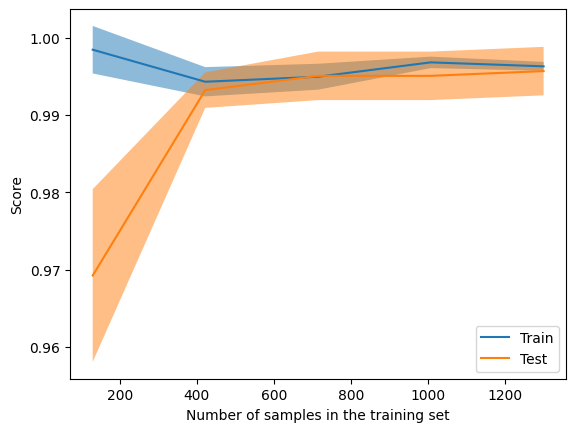
    


The model appears to not be suffering from overfitting, albeit not much. The result is still very good.

We will plot a confusion matrix to see the error that where made as well as compute the different scores once again.


```python
from sklearn.metrics import confusion_matrix,f1_score,accuracy_score,ConfusionMatrixDisplay

```


```python
conf_mat=confusion_matrix(predic_y,test_set["color"].map(lambda x: 1 if x=="red" else 0))
ConfusionMatrixDisplay(conf_mat,display_labels=["white","red"]).plot()
plt.show()
print(f'f1:{f1_score(predic_y,test_set["color"].map(lambda x: 1 if x=="red" else 0))}')
print(f'accuracy:{accuracy_score(predic_y,test_set["color"].map(lambda x: 1 if x=="red" else 0))}')
```


    
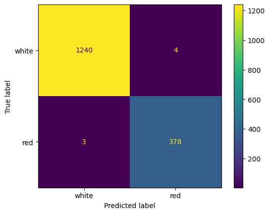
    


    f1:0.9908256880733946
    accuracy:0.9956923076923077


Considering the best scores are in the (very) high 90's, we can consider the model performances as good.

### Basic model interpretability: inspecting the model

We will then check the feature importance, that is wich feature is/are important(s) for the classifcation and wich aren't. 


```python
coefs=list(zip(list(X.drop("color",axis=1)),(grid_search.best_estimator_.coef_.flatten())))
#sns.swarmplot(data=coefs, x="importance", y="feature")
print(coefs)

```

    [('fixed_acidity', np.float64(0.20517423666668272)), ('volatile_acidity', np.float64(1.2375096818107851)), ('citric_acid', np.float64(-0.36562558591476374)), ('residual_sugar', np.float64(-5.033383921140923)), ('chlorides', np.float64(0.6220580580388668)), ('free_sulfur_dioxide', np.float64(1.6905244053839126)), ('total_sulfur_dioxide', np.float64(-4.369627722505803)), ('density', np.float64(6.234778650684632)), ('pH', np.float64(0.3068741308408787)), ('sulphates', np.float64(0.7400521737230683)), ('alcohol', np.float64(2.3181775460931333))]


Positive component indicate an impact in a direction, negative in the other. The scores themselves are subject to change depending on dataset shuffling.

### Removing features to test their importance

We will now remove the most important feature (density in this case) to see what happens to the classification score. 


```python
reg2=LogisticRegression()
gridValues={'C': [0.001,0.01,0.1,1,10,100,1000]}
grid_search_2 = GridSearchCV(
                           estimator = reg2,
                           param_grid = gridValues,
                           scoring = 'f1',
                           cv = 5,
                           )
grid_search_2.fit(test_set.drop(["color","density"],axis=1),test_set["color"].map(lambda x: 1 if x=="red" else 0))
```


<style>#sk-container-id-5 {
  /* Definition of color scheme common for light and dark mode */
  --sklearn-color-text: black;
  --sklearn-color-line: gray;
  /* Definition of color scheme for unfitted estimators */
  --sklearn-color-unfitted-level-0: #fff5e6;
  --sklearn-color-unfitted-level-1: #f6e4d2;
  --sklearn-color-unfitted-level-2: #ffe0b3;
  --sklearn-color-unfitted-level-3: chocolate;
  /* Definition of color scheme for fitted estimators */
  --sklearn-color-fitted-level-0: #f0f8ff;
  --sklearn-color-fitted-level-1: #d4ebff;
  --sklearn-color-fitted-level-2: #b3dbfd;
  --sklearn-color-fitted-level-3: cornflowerblue;

  /* Specific color for light theme */
  --sklearn-color-text-on-default-background: var(--sg-text-color, var(--theme-code-foreground, var(--jp-content-font-color1, black)));
  --sklearn-color-background: var(--sg-background-color, var(--theme-background, var(--jp-layout-color0, white)));
  --sklearn-color-border-box: var(--sg-text-color, var(--theme-code-foreground, var(--jp-content-font-color1, black)));
  --sklearn-color-icon: #696969;

  @media (prefers-color-scheme: dark) {
    /* Redefinition of color scheme for dark theme */
    --sklearn-color-text-on-default-background: var(--sg-text-color, var(--theme-code-foreground, var(--jp-content-font-color1, white)));
    --sklearn-color-background: var(--sg-background-color, var(--theme-background, var(--jp-layout-color0, #111)));
    --sklearn-color-border-box: var(--sg-text-color, var(--theme-code-foreground, var(--jp-content-font-color1, white)));
    --sklearn-color-icon: #878787;
  }
}

#sk-container-id-5 {
  color: var(--sklearn-color-text);
}

#sk-container-id-5 pre {
  padding: 0;
}

#sk-container-id-5 input.sk-hidden--visually {
  border: 0;
  clip: rect(1px 1px 1px 1px);
  clip: rect(1px, 1px, 1px, 1px);
  height: 1px;
  margin: -1px;
  overflow: hidden;
  padding: 0;
  position: absolute;
  width: 1px;
}

#sk-container-id-5 div.sk-dashed-wrapped {
  border: 1px dashed var(--sklearn-color-line);
  margin: 0 0.4em 0.5em 0.4em;
  box-sizing: border-box;
  padding-bottom: 0.4em;
  background-color: var(--sklearn-color-background);
}

#sk-container-id-5 div.sk-container {
  /* jupyter's `normalize.less` sets `[hidden] { display: none; }`
     but bootstrap.min.css set `[hidden] { display: none !important; }`
     so we also need the `!important` here to be able to override the
     default hidden behavior on the sphinx rendered scikit-learn.org.
     See: https://github.com/scikit-learn/scikit-learn/issues/21755 */
  display: inline-block !important;
  position: relative;
}

#sk-container-id-5 div.sk-text-repr-fallback {
  display: none;
}

div.sk-parallel-item,
div.sk-serial,
div.sk-item {
  /* draw centered vertical line to link estimators */
  background-image: linear-gradient(var(--sklearn-color-text-on-default-background), var(--sklearn-color-text-on-default-background));
  background-size: 2px 100%;
  background-repeat: no-repeat;
  background-position: center center;
}

/* Parallel-specific style estimator block */

#sk-container-id-5 div.sk-parallel-item::after {
  content: "";
  width: 100%;
  border-bottom: 2px solid var(--sklearn-color-text-on-default-background);
  flex-grow: 1;
}

#sk-container-id-5 div.sk-parallel {
  display: flex;
  align-items: stretch;
  justify-content: center;
  background-color: var(--sklearn-color-background);
  position: relative;
}

#sk-container-id-5 div.sk-parallel-item {
  display: flex;
  flex-direction: column;
}

#sk-container-id-5 div.sk-parallel-item:first-child::after {
  align-self: flex-end;
  width: 50%;
}

#sk-container-id-5 div.sk-parallel-item:last-child::after {
  align-self: flex-start;
  width: 50%;
}

#sk-container-id-5 div.sk-parallel-item:only-child::after {
  width: 0;
}

/* Serial-specific style estimator block */

#sk-container-id-5 div.sk-serial {
  display: flex;
  flex-direction: column;
  align-items: center;
  background-color: var(--sklearn-color-background);
  padding-right: 1em;
  padding-left: 1em;
}


/* Toggleable style: style used for estimator/Pipeline/ColumnTransformer box that is
clickable and can be expanded/collapsed.
- Pipeline and ColumnTransformer use this feature and define the default style
- Estimators will overwrite some part of the style using the `sk-estimator` class
*/

/* Pipeline and ColumnTransformer style (default) */

#sk-container-id-5 div.sk-toggleable {
  /* Default theme specific background. It is overwritten whether we have a
  specific estimator or a Pipeline/ColumnTransformer */
  background-color: var(--sklearn-color-background);
}

/* Toggleable label */
#sk-container-id-5 label.sk-toggleable__label {
  cursor: pointer;
  display: block;
  width: 100%;
  margin-bottom: 0;
  padding: 0.5em;
  box-sizing: border-box;
  text-align: center;
}

#sk-container-id-5 label.sk-toggleable__label-arrow:before {
  /* Arrow on the left of the label */
  content: "▸";
  float: left;
  margin-right: 0.25em;
  color: var(--sklearn-color-icon);
}

#sk-container-id-5 label.sk-toggleable__label-arrow:hover:before {
  color: var(--sklearn-color-text);
}

/* Toggleable content - dropdown */

#sk-container-id-5 div.sk-toggleable__content {
  max-height: 0;
  max-width: 0;
  overflow: hidden;
  text-align: left;
  /* unfitted */
  background-color: var(--sklearn-color-unfitted-level-0);
}

#sk-container-id-5 div.sk-toggleable__content.fitted {
  /* fitted */
  background-color: var(--sklearn-color-fitted-level-0);
}

#sk-container-id-5 div.sk-toggleable__content pre {
  margin: 0.2em;
  border-radius: 0.25em;
  color: var(--sklearn-color-text);
  /* unfitted */
  background-color: var(--sklearn-color-unfitted-level-0);
}

#sk-container-id-5 div.sk-toggleable__content.fitted pre {
  /* unfitted */
  background-color: var(--sklearn-color-fitted-level-0);
}

#sk-container-id-5 input.sk-toggleable__control:checked~div.sk-toggleable__content {
  /* Expand drop-down */
  max-height: 200px;
  max-width: 100%;
  overflow: auto;
}

#sk-container-id-5 input.sk-toggleable__control:checked~label.sk-toggleable__label-arrow:before {
  content: "▾";
}

/* Pipeline/ColumnTransformer-specific style */

#sk-container-id-5 div.sk-label input.sk-toggleable__control:checked~label.sk-toggleable__label {
  color: var(--sklearn-color-text);
  background-color: var(--sklearn-color-unfitted-level-2);
}

#sk-container-id-5 div.sk-label.fitted input.sk-toggleable__control:checked~label.sk-toggleable__label {
  background-color: var(--sklearn-color-fitted-level-2);
}

/* Estimator-specific style */

/* Colorize estimator box */
#sk-container-id-5 div.sk-estimator input.sk-toggleable__control:checked~label.sk-toggleable__label {
  /* unfitted */
  background-color: var(--sklearn-color-unfitted-level-2);
}

#sk-container-id-5 div.sk-estimator.fitted input.sk-toggleable__control:checked~label.sk-toggleable__label {
  /* fitted */
  background-color: var(--sklearn-color-fitted-level-2);
}

#sk-container-id-5 div.sk-label label.sk-toggleable__label,
#sk-container-id-5 div.sk-label label {
  /* The background is the default theme color */
  color: var(--sklearn-color-text-on-default-background);
}

/* On hover, darken the color of the background */
#sk-container-id-5 div.sk-label:hover label.sk-toggleable__label {
  color: var(--sklearn-color-text);
  background-color: var(--sklearn-color-unfitted-level-2);
}

/* Label box, darken color on hover, fitted */
#sk-container-id-5 div.sk-label.fitted:hover label.sk-toggleable__label.fitted {
  color: var(--sklearn-color-text);
  background-color: var(--sklearn-color-fitted-level-2);
}

/* Estimator label */

#sk-container-id-5 div.sk-label label {
  font-family: monospace;
  font-weight: bold;
  display: inline-block;
  line-height: 1.2em;
}

#sk-container-id-5 div.sk-label-container {
  text-align: center;
}

/* Estimator-specific */
#sk-container-id-5 div.sk-estimator {
  font-family: monospace;
  border: 1px dotted var(--sklearn-color-border-box);
  border-radius: 0.25em;
  box-sizing: border-box;
  margin-bottom: 0.5em;
  /* unfitted */
  background-color: var(--sklearn-color-unfitted-level-0);
}

#sk-container-id-5 div.sk-estimator.fitted {
  /* fitted */
  background-color: var(--sklearn-color-fitted-level-0);
}

/* on hover */
#sk-container-id-5 div.sk-estimator:hover {
  /* unfitted */
  background-color: var(--sklearn-color-unfitted-level-2);
}

#sk-container-id-5 div.sk-estimator.fitted:hover {
  /* fitted */
  background-color: var(--sklearn-color-fitted-level-2);
}

/* Specification for estimator info (e.g. "i" and "?") */

/* Common style for "i" and "?" */

.sk-estimator-doc-link,
a:link.sk-estimator-doc-link,
a:visited.sk-estimator-doc-link {
  float: right;
  font-size: smaller;
  line-height: 1em;
  font-family: monospace;
  background-color: var(--sklearn-color-background);
  border-radius: 1em;
  height: 1em;
  width: 1em;
  text-decoration: none !important;
  margin-left: 1ex;
  /* unfitted */
  border: var(--sklearn-color-unfitted-level-1) 1pt solid;
  color: var(--sklearn-color-unfitted-level-1);
}

.sk-estimator-doc-link.fitted,
a:link.sk-estimator-doc-link.fitted,
a:visited.sk-estimator-doc-link.fitted {
  /* fitted */
  border: var(--sklearn-color-fitted-level-1) 1pt solid;
  color: var(--sklearn-color-fitted-level-1);
}

/* On hover */
div.sk-estimator:hover .sk-estimator-doc-link:hover,
.sk-estimator-doc-link:hover,
div.sk-label-container:hover .sk-estimator-doc-link:hover,
.sk-estimator-doc-link:hover {
  /* unfitted */
  background-color: var(--sklearn-color-unfitted-level-3);
  color: var(--sklearn-color-background);
  text-decoration: none;
}

div.sk-estimator.fitted:hover .sk-estimator-doc-link.fitted:hover,
.sk-estimator-doc-link.fitted:hover,
div.sk-label-container:hover .sk-estimator-doc-link.fitted:hover,
.sk-estimator-doc-link.fitted:hover {
  /* fitted */
  background-color: var(--sklearn-color-fitted-level-3);
  color: var(--sklearn-color-background);
  text-decoration: none;
}

/* Span, style for the box shown on hovering the info icon */
.sk-estimator-doc-link span {
  display: none;
  z-index: 9999;
  position: relative;
  font-weight: normal;
  right: .2ex;
  padding: .5ex;
  margin: .5ex;
  width: min-content;
  min-width: 20ex;
  max-width: 50ex;
  color: var(--sklearn-color-text);
  box-shadow: 2pt 2pt 4pt #999;
  /* unfitted */
  background: var(--sklearn-color-unfitted-level-0);
  border: .5pt solid var(--sklearn-color-unfitted-level-3);
}

.sk-estimator-doc-link.fitted span {
  /* fitted */
  background: var(--sklearn-color-fitted-level-0);
  border: var(--sklearn-color-fitted-level-3);
}

.sk-estimator-doc-link:hover span {
  display: block;
}

/* "?"-specific style due to the `<a>` HTML tag */

#sk-container-id-5 a.estimator_doc_link {
  float: right;
  font-size: 1rem;
  line-height: 1em;
  font-family: monospace;
  background-color: var(--sklearn-color-background);
  border-radius: 1rem;
  height: 1rem;
  width: 1rem;
  text-decoration: none;
  /* unfitted */
  color: var(--sklearn-color-unfitted-level-1);
  border: var(--sklearn-color-unfitted-level-1) 1pt solid;
}

#sk-container-id-5 a.estimator_doc_link.fitted {
  /* fitted */
  border: var(--sklearn-color-fitted-level-1) 1pt solid;
  color: var(--sklearn-color-fitted-level-1);
}

/* On hover */
#sk-container-id-5 a.estimator_doc_link:hover {
  /* unfitted */
  background-color: var(--sklearn-color-unfitted-level-3);
  color: var(--sklearn-color-background);
  text-decoration: none;
}

#sk-container-id-5 a.estimator_doc_link.fitted:hover {
  /* fitted */
  background-color: var(--sklearn-color-fitted-level-3);
}
</style><div id="sk-container-id-5" class="sk-top-container"><div class="sk-text-repr-fallback"><pre>GridSearchCV(cv=5, estimator=LogisticRegression(),
             param_grid={&#x27;C&#x27;: [0.001, 0.01, 0.1, 1, 10, 100, 1000]},
             scoring=&#x27;f1&#x27;)</pre><b>In a Jupyter environment, please rerun this cell to show the HTML representation or trust the notebook. <br />On GitHub, the HTML representation is unable to render, please try loading this page with nbviewer.org.</b></div><div class="sk-container" hidden><div class="sk-item sk-dashed-wrapped"><div class="sk-label-container"><div class="sk-label fitted sk-toggleable"><input class="sk-toggleable__control sk-hidden--visually" id="sk-estimator-id-13" type="checkbox" ><label for="sk-estimator-id-13" class="sk-toggleable__label fitted sk-toggleable__label-arrow fitted">&nbsp;&nbsp;GridSearchCV<a class="sk-estimator-doc-link fitted" rel="noreferrer" target="_blank" href="https://scikit-learn.org/1.5/modules/generated/sklearn.model_selection.GridSearchCV.html">?<span>Documentation for GridSearchCV</span></a><span class="sk-estimator-doc-link fitted">i<span>Fitted</span></span></label><div class="sk-toggleable__content fitted"><pre>GridSearchCV(cv=5, estimator=LogisticRegression(),
             param_grid={&#x27;C&#x27;: [0.001, 0.01, 0.1, 1, 10, 100, 1000]},
             scoring=&#x27;f1&#x27;)</pre></div> </div></div><div class="sk-parallel"><div class="sk-parallel-item"><div class="sk-item"><div class="sk-label-container"><div class="sk-label fitted sk-toggleable"><input class="sk-toggleable__control sk-hidden--visually" id="sk-estimator-id-14" type="checkbox" ><label for="sk-estimator-id-14" class="sk-toggleable__label fitted sk-toggleable__label-arrow fitted">best_estimator_: LogisticRegression</label><div class="sk-toggleable__content fitted"><pre>LogisticRegression(C=100)</pre></div> </div></div><div class="sk-serial"><div class="sk-item"><div class="sk-estimator fitted sk-toggleable"><input class="sk-toggleable__control sk-hidden--visually" id="sk-estimator-id-15" type="checkbox" ><label for="sk-estimator-id-15" class="sk-toggleable__label fitted sk-toggleable__label-arrow fitted">&nbsp;LogisticRegression<a class="sk-estimator-doc-link fitted" rel="noreferrer" target="_blank" href="https://scikit-learn.org/1.5/modules/generated/sklearn.linear_model.LogisticRegression.html">?<span>Documentation for LogisticRegression</span></a></label><div class="sk-toggleable__content fitted"><pre>LogisticRegression(C=100)</pre></div> </div></div></div></div></div></div></div></div></div>


```python
print("train values:")
print(f'best c is {grid_search.best_estimator_}')
print(f'best score is {grid_search.best_score_}')
```

    train values:
    best c is LogisticRegression(C=100)
    best score is 0.9908324733402132


```python
predic_y_2=grid_search_2.best_estimator_.predict(test_set.drop(["color","density"],axis=1))
LearningCurveDisplay.from_estimator(grid_search_2.best_estimator_,test_set.drop(["color","density"],axis=1),test_set["color"].map(lambda x: 1 if x=="red" else 0))
plt.show()
```


    
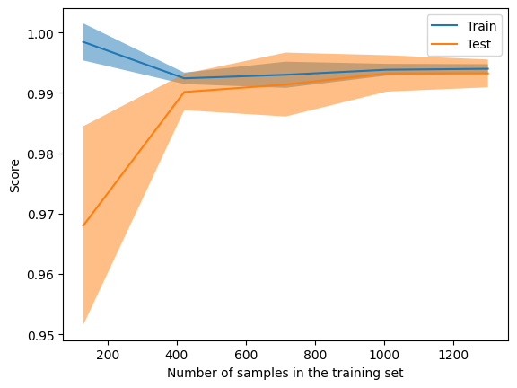
    


```python
conf_mat_2=confusion_matrix(predic_y_2,test_set["color"].map(lambda x: 1 if x=="red" else 0))
ConfusionMatrixDisplay(conf_mat_2,display_labels=["white","red"]).plot()
plt.show()
print(f'f1:{f1_score(predic_y_2,test_set["color"].map(lambda x: 1 if x=="red" else 0))}')
print(f'accuracy:{accuracy_score(predic_y_2,test_set["color"].map(lambda x: 1 if x=="red" else 0))}')
```


    
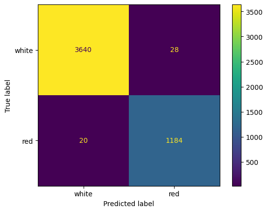
    


    f1:0.9801324503311258
    accuracy:0.9901477832512315


The f1 score is slightly lower, but the score is so high still we can consider the removal of the feature irrelevant.

### Using Shapley values

Now, use SHAP to explore how the model perceives a 'red' and 'white' wine.


```python
#sns.swarmplot(data=rescaled_X,x="color")
import shap
import xgboost

```


```python
model = xgboost.XGBClassifier().fit(X.drop("color",axis=1),X["color"].map(lambda x: 1 if x=="red" else 0))

explainer=shap.Explainer(model,X.drop("color",axis=1))
shap_values=explainer(X.drop("color",axis=1))
```

     98%|===================| 6345/6497 [00:13<00:00]        


```python
shap.plots.beeswarm(shap_values)
```


    
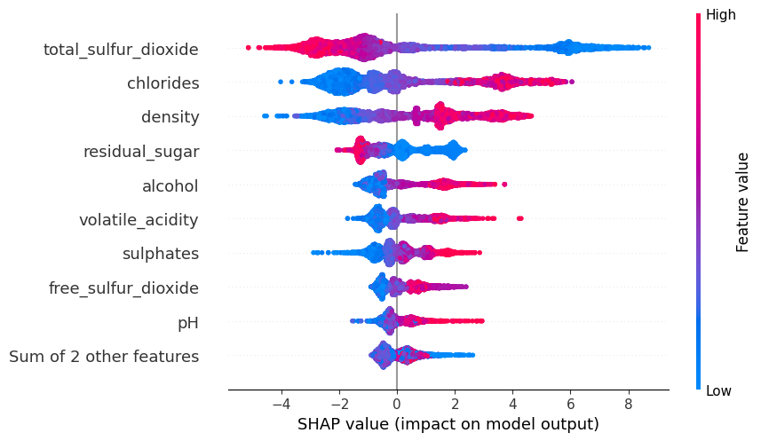
    


We can see here the importance of each feature depending of their value. 

We can the use a partial dependence plot to see the impact of the value of a specific feature.

The partial dependence plot (short PDP or PD plot) shows the marginal effect one or two features have on the predicted outcome of a machine learning model (J. H. Friedman 200130). A partial dependence plot can show whether the relationship between the target and a feature is linear, monotonic or more complex. For example, when applied to a linear regression model, partial dependence plots always show a linear relationship.


```python

shap.partial_dependence_plot(
    "density",
    grid_search.best_estimator_.predict,
    X.drop("color",axis=1),
    ice=False,
    model_expected_value=True,
    feature_expected_value=True,
)
```


    
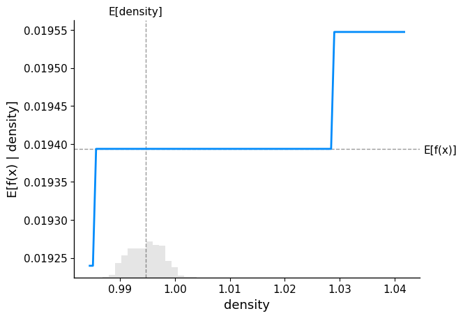
    


Here we can see the impact of density. The higher it is, the more impact on the classification.

- Now use a waterfall diagram on a specific red and white wine and see how the model has made this specific prediction. 


```python
"""shap.plots.waterfall(shap_values[0], max_display=20,show=False)
plt.title("correct red wine")
plt.show()
shap.plots.waterfall(shap_values[5000], max_display=20,show=False)
plt.title("correct white wine")
plt.show()"""

figs, ax = plt.subplots(1,2,figsize=(10,5))
plt.sca(ax[0])
shap.plots.waterfall(shap_values[0], max_display=20,show=False)
ax[0].set_title("correct red wine")
plt.sca(ax[1])
shap.plots.waterfall(shap_values[4000], max_display=20,show=False)
ax[1].set_title("correct white wine")
plt.subplots_adjust(wspace=1)
figs.set_size_inches(20, 8)
plt.show()

```


    
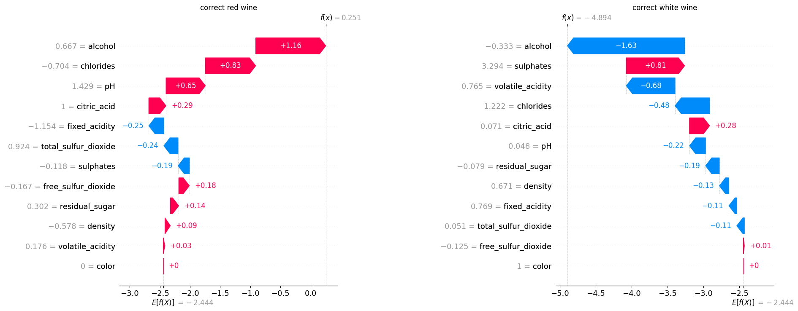
    


Here we can compare the impact of each features between a correctly classified red and white wine.

- Now, let's take an example where the model has made an incorrect prediction, and see how it made this prediction.


```python
error=[]
Y_color=list(test_set["color"].map(lambda x: 1 if x=="red" else 0))

for idx,res in enumerate(predic_y):
    if res!=Y_color[idx]:
        #print(res,Y_color[idx])
        error.append((idx,"red" if Y_color[idx] else "white"))
print(error)
print(len(error))
```

    [(238, 'white'), (342, 'red'), (402, 'white'), (460, 'red'), (681, 'white'), (841, 'red'), (1077, 'white'), (1472, 'white'), (1718, 'white'), (1776, 'red'), (1783, 'red'), (1870, 'white'), (1879, 'white'), (2303, 'red'), (2326, 'white'), (2621, 'white'), (2868, 'red'), (2900, 'white'), (3165, 'white'), (3436, 'red'), (3451, 'white'), (3489, 'white'), (3843, 'red'), (4396, 'red'), (4461, 'red'), (4495, 'red')]
    26


```python
figs, ax = plt.subplots(1,2,figsize=(10,5))
plt.sca(ax[0])
shap.plots.waterfall(shap_values[0], max_display=20,show=False)
ax[0].set_title("correct red wine")
plt.sca(ax[1])
shap.plots.waterfall(shap_values[342], max_display=20,show=False)
ax[1].set_title("incorrect red wine")
plt.subplots_adjust(wspace=1)
figs.set_size_inches(20, 8)
plt.show()
```


    
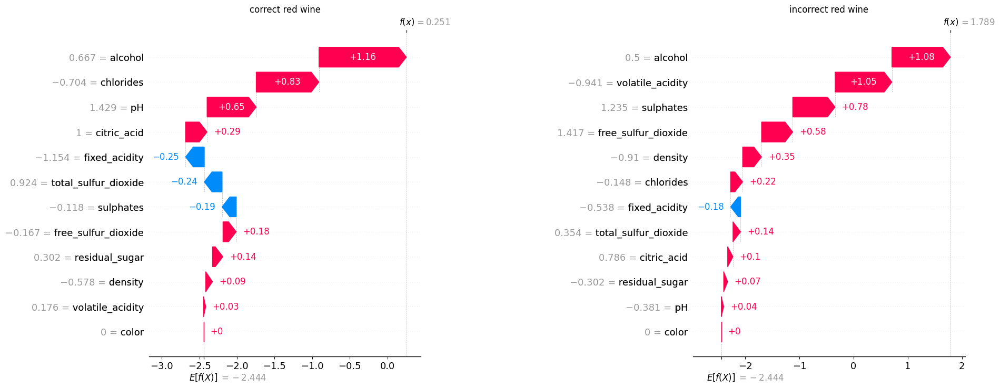
    


We can see here what a correctly classified red wine looks like, and what an incorrectly classified one lokks like.

# Good vs Bad classification (3h)

We will now stop trying to find the color, and predict the quality of a wine, with those having a scrore superior to 6 being considered good.


```python
binary_quality=y.map(lambda x : "good" if x>6 else "bad")
print(binary_quality)
X_resc_quality=rescaled_X.join(binary_quality)
print(X_resc_quality.head())
```

         quality
    0        bad
    1        bad
    2        bad
    3        bad
    4        bad
    ...      ...
    6492     bad
    6493     bad
    6494     bad
    6495    good
    6496     bad
    
    [6497 rows x 1 columns]
       fixed_acidity  volatile_acidity  citric_acid  residual_sugar  chlorides  \
    0       0.307692          2.411765    -2.214286       -0.174603   1.074074   
    1       0.615385          3.470588    -2.214286       -0.063492   1.888889   
    2       0.615385          2.764706    -1.928571       -0.111111   1.666667   
    3       3.230769         -0.058824     1.785714       -0.174603   1.037037   
    4       0.307692          2.411765    -2.214286       -0.174603   1.074074   
    
       free_sulfur_dioxide  total_sulfur_dioxide   density        pH  sulphates  \
    0            -0.750000             -1.063291  0.625806  1.428571   0.294118   
    1            -0.166667             -0.645570  0.410753 -0.047619   1.000000   
    2            -0.583333             -0.810127  0.453763  0.238095   0.823529   
    3            -0.500000             -0.734177  0.668817 -0.238095   0.411765   
    4            -0.750000             -1.063291  0.625806  1.428571   0.294118   
    
        alcohol color quality  
    0 -0.500000   red     bad  
    1 -0.277778   red     bad  
    2 -0.277778   red     bad  
    3 -0.277778   red     bad  
    4 -0.500000   red     bad  


```python
list(X_resc_quality)
```


    ['fixed_acidity',
     'volatile_acidity',
     'citric_acid',
     'residual_sugar',
     'chlorides',
     'free_sulfur_dioxide',
     'total_sulfur_dioxide',
     'density',
     'pH',
     'sulphates',
     'alcohol',
     'color',
     'quality']


One question that we might ask right away is:

- Is there any correlation of the quality and the color of the wine? 

Ideally, there should be almost none. Why could it be a problem otherwise?


```python


red=X_resc_quality[X["color"]=="red"]
white=X_resc_quality[X["color"]=="white"]

print(f'number of bad white wine: {white[white["quality"]=="bad"]["quality"].count()} out of {white["quality"].count()}, or {white[white["quality"]=="bad"]["quality"].count()/white["quality"].count()*100}%')
print(f'number of bad red wine: {red[red["quality"]=="bad"]["quality"].count()} out of {red["quality"].count()}, or {red[red["quality"]=="bad"]["quality"].count()/red["quality"].count()*100}%')
```

    number of bad white wine: 3838 out of 4898, or 78.35851367905268%
    number of bad red wine: 1382 out of 1599, or 86.42901813633522%


We can see that non, there isn't an especially high correlation between color and quality, a good thing because this would be an enormous bias on the dataset.

We will now plot a heatmap of the mean feature value of good and bad wines.


```python
X_bad_mean=X_resc_quality[X_resc_quality["quality"]=="bad"].drop(["quality","color"],axis=1).abs().mean()
X_good_mean=X_resc_quality[X_resc_quality["quality"]=="good"].drop(["quality","color"],axis=1).abs().mean()
res2=pd.DataFrame({"bad":X_bad_mean,"good":X_good_mean})
plt.matshow(res2.transpose(),cmap="RdBu")
plt.xticks(labels=list(X.drop("color",axis=1)),ticks=range(0,11),rotation=45)
plt.yticks(labels=["bad","good"],ticks=[0,1])
plt.colorbar()
plt.show()
```


    
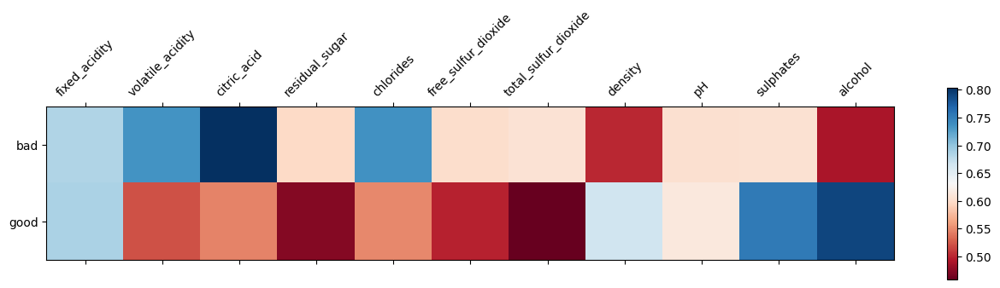
    


Some things we can see is that the alcohol content plays a huge role, for exemple.

It is a lot more difficult now to tell apart good from bad wines. Let's turn to a more complex model, which is a [Gradient Boosting](https://en.wikipedia.org/wiki/Gradient_boosting) [Trees](https://xgboost.readthedocs.io/en/stable/tutorials/model.html). For the sake of interpretability, design your notebook so that you can easily filter on only white and red wines and perform again the entire procedure.

Let's first train a XGBClassifier model to distinguish between good and bad wines. Make sure to use the same best-practices (train/test split, cross-validation) as we did before. Note that the regularization of the GBTs is a lot more complex than for Logistic Regression. Test the following parameters:

  ```py
  param_grid = {
    "max_depth": [3, 4, 5],  # Focus on shallow trees to reduce complexity
    "learning_rate": [0.01, 0.05, 0.1],  # Slower learning rates
    "n_estimators": [50, 100],  # More trees but keep it reasonable
    "min_child_weight": [1, 3],  # Regularization to control split thresholds
    "subsample": [0.7, 0.9],  # Sampling rate for boosting
    "colsample_bytree": [0.7, 1.0],  # Sampling rate for columns
    "gamma": [0, 0.1],  # Regularization to penalize complex trees
  }
  ```


```python
from xgboost import XGBClassifier

```


```python
train_set_2 , test_set_2= train_test_split(X_resc_quality)
```


```python
gbc=XGBClassifier()
param_grid = {
    "max_depth": [3, 4, 5],  # Focus on shallow trees to reduce complexity
    "learning_rate": [0.01, 0.05, 0.1],  # Slower learning rates
    "n_estimators": [50, 100],  # More trees but keep it reasonable
    "min_child_weight": [1, 3],  # Regularization to control split thresholds
    "subsample": [0.7, 0.9],  # Sampling rate for boosting
    "colsample_bytree": [0.7, 1.0],  # Sampling rate for columns
    "gamma": [0, 0.1],  # Regularization to penalize complex trees
  }
transformed_df=train_set_2.drop(["quality","color"],axis=1).join(train_set_2["color"].map(lambda x: 1 if x=="red" else 0))
grid_search_3 = GridSearchCV(
                           estimator = gbc,
                           param_grid = param_grid,
                           scoring = 'f1',
                           cv = 5,
                           n_jobs=4,
                           )
grid_search_3.fit(transformed_df,train_set_2["quality"].map(lambda x: 1 if x=="good" else 0))
```


<style>#sk-container-id-3 {
  /* Definition of color scheme common for light and dark mode */
  --sklearn-color-text: black;
  --sklearn-color-line: gray;
  /* Definition of color scheme for unfitted estimators */
  --sklearn-color-unfitted-level-0: #fff5e6;
  --sklearn-color-unfitted-level-1: #f6e4d2;
  --sklearn-color-unfitted-level-2: #ffe0b3;
  --sklearn-color-unfitted-level-3: chocolate;
  /* Definition of color scheme for fitted estimators */
  --sklearn-color-fitted-level-0: #f0f8ff;
  --sklearn-color-fitted-level-1: #d4ebff;
  --sklearn-color-fitted-level-2: #b3dbfd;
  --sklearn-color-fitted-level-3: cornflowerblue;

  /* Specific color for light theme */
  --sklearn-color-text-on-default-background: var(--sg-text-color, var(--theme-code-foreground, var(--jp-content-font-color1, black)));
  --sklearn-color-background: var(--sg-background-color, var(--theme-background, var(--jp-layout-color0, white)));
  --sklearn-color-border-box: var(--sg-text-color, var(--theme-code-foreground, var(--jp-content-font-color1, black)));
  --sklearn-color-icon: #696969;

  @media (prefers-color-scheme: dark) {
    /* Redefinition of color scheme for dark theme */
    --sklearn-color-text-on-default-background: var(--sg-text-color, var(--theme-code-foreground, var(--jp-content-font-color1, white)));
    --sklearn-color-background: var(--sg-background-color, var(--theme-background, var(--jp-layout-color0, #111)));
    --sklearn-color-border-box: var(--sg-text-color, var(--theme-code-foreground, var(--jp-content-font-color1, white)));
    --sklearn-color-icon: #878787;
  }
}

#sk-container-id-3 {
  color: var(--sklearn-color-text);
}

#sk-container-id-3 pre {
  padding: 0;
}

#sk-container-id-3 input.sk-hidden--visually {
  border: 0;
  clip: rect(1px 1px 1px 1px);
  clip: rect(1px, 1px, 1px, 1px);
  height: 1px;
  margin: -1px;
  overflow: hidden;
  padding: 0;
  position: absolute;
  width: 1px;
}

#sk-container-id-3 div.sk-dashed-wrapped {
  border: 1px dashed var(--sklearn-color-line);
  margin: 0 0.4em 0.5em 0.4em;
  box-sizing: border-box;
  padding-bottom: 0.4em;
  background-color: var(--sklearn-color-background);
}

#sk-container-id-3 div.sk-container {
  /* jupyter's `normalize.less` sets `[hidden] { display: none; }`
     but bootstrap.min.css set `[hidden] { display: none !important; }`
     so we also need the `!important` here to be able to override the
     default hidden behavior on the sphinx rendered scikit-learn.org.
     See: https://github.com/scikit-learn/scikit-learn/issues/21755 */
  display: inline-block !important;
  position: relative;
}

#sk-container-id-3 div.sk-text-repr-fallback {
  display: none;
}

div.sk-parallel-item,
div.sk-serial,
div.sk-item {
  /* draw centered vertical line to link estimators */
  background-image: linear-gradient(var(--sklearn-color-text-on-default-background), var(--sklearn-color-text-on-default-background));
  background-size: 2px 100%;
  background-repeat: no-repeat;
  background-position: center center;
}

/* Parallel-specific style estimator block */

#sk-container-id-3 div.sk-parallel-item::after {
  content: "";
  width: 100%;
  border-bottom: 2px solid var(--sklearn-color-text-on-default-background);
  flex-grow: 1;
}

#sk-container-id-3 div.sk-parallel {
  display: flex;
  align-items: stretch;
  justify-content: center;
  background-color: var(--sklearn-color-background);
  position: relative;
}

#sk-container-id-3 div.sk-parallel-item {
  display: flex;
  flex-direction: column;
}

#sk-container-id-3 div.sk-parallel-item:first-child::after {
  align-self: flex-end;
  width: 50%;
}

#sk-container-id-3 div.sk-parallel-item:last-child::after {
  align-self: flex-start;
  width: 50%;
}

#sk-container-id-3 div.sk-parallel-item:only-child::after {
  width: 0;
}

/* Serial-specific style estimator block */

#sk-container-id-3 div.sk-serial {
  display: flex;
  flex-direction: column;
  align-items: center;
  background-color: var(--sklearn-color-background);
  padding-right: 1em;
  padding-left: 1em;
}


/* Toggleable style: style used for estimator/Pipeline/ColumnTransformer box that is
clickable and can be expanded/collapsed.
- Pipeline and ColumnTransformer use this feature and define the default style
- Estimators will overwrite some part of the style using the `sk-estimator` class
*/

/* Pipeline and ColumnTransformer style (default) */

#sk-container-id-3 div.sk-toggleable {
  /* Default theme specific background. It is overwritten whether we have a
  specific estimator or a Pipeline/ColumnTransformer */
  background-color: var(--sklearn-color-background);
}

/* Toggleable label */
#sk-container-id-3 label.sk-toggleable__label {
  cursor: pointer;
  display: block;
  width: 100%;
  margin-bottom: 0;
  padding: 0.5em;
  box-sizing: border-box;
  text-align: center;
}

#sk-container-id-3 label.sk-toggleable__label-arrow:before {
  /* Arrow on the left of the label */
  content: "▸";
  float: left;
  margin-right: 0.25em;
  color: var(--sklearn-color-icon);
}

#sk-container-id-3 label.sk-toggleable__label-arrow:hover:before {
  color: var(--sklearn-color-text);
}

/* Toggleable content - dropdown */

#sk-container-id-3 div.sk-toggleable__content {
  max-height: 0;
  max-width: 0;
  overflow: hidden;
  text-align: left;
  /* unfitted */
  background-color: var(--sklearn-color-unfitted-level-0);
}

#sk-container-id-3 div.sk-toggleable__content.fitted {
  /* fitted */
  background-color: var(--sklearn-color-fitted-level-0);
}

#sk-container-id-3 div.sk-toggleable__content pre {
  margin: 0.2em;
  border-radius: 0.25em;
  color: var(--sklearn-color-text);
  /* unfitted */
  background-color: var(--sklearn-color-unfitted-level-0);
}

#sk-container-id-3 div.sk-toggleable__content.fitted pre {
  /* unfitted */
  background-color: var(--sklearn-color-fitted-level-0);
}

#sk-container-id-3 input.sk-toggleable__control:checked~div.sk-toggleable__content {
  /* Expand drop-down */
  max-height: 200px;
  max-width: 100%;
  overflow: auto;
}

#sk-container-id-3 input.sk-toggleable__control:checked~label.sk-toggleable__label-arrow:before {
  content: "▾";
}

/* Pipeline/ColumnTransformer-specific style */

#sk-container-id-3 div.sk-label input.sk-toggleable__control:checked~label.sk-toggleable__label {
  color: var(--sklearn-color-text);
  background-color: var(--sklearn-color-unfitted-level-2);
}

#sk-container-id-3 div.sk-label.fitted input.sk-toggleable__control:checked~label.sk-toggleable__label {
  background-color: var(--sklearn-color-fitted-level-2);
}

/* Estimator-specific style */

/* Colorize estimator box */
#sk-container-id-3 div.sk-estimator input.sk-toggleable__control:checked~label.sk-toggleable__label {
  /* unfitted */
  background-color: var(--sklearn-color-unfitted-level-2);
}

#sk-container-id-3 div.sk-estimator.fitted input.sk-toggleable__control:checked~label.sk-toggleable__label {
  /* fitted */
  background-color: var(--sklearn-color-fitted-level-2);
}

#sk-container-id-3 div.sk-label label.sk-toggleable__label,
#sk-container-id-3 div.sk-label label {
  /* The background is the default theme color */
  color: var(--sklearn-color-text-on-default-background);
}

/* On hover, darken the color of the background */
#sk-container-id-3 div.sk-label:hover label.sk-toggleable__label {
  color: var(--sklearn-color-text);
  background-color: var(--sklearn-color-unfitted-level-2);
}

/* Label box, darken color on hover, fitted */
#sk-container-id-3 div.sk-label.fitted:hover label.sk-toggleable__label.fitted {
  color: var(--sklearn-color-text);
  background-color: var(--sklearn-color-fitted-level-2);
}

/* Estimator label */

#sk-container-id-3 div.sk-label label {
  font-family: monospace;
  font-weight: bold;
  display: inline-block;
  line-height: 1.2em;
}

#sk-container-id-3 div.sk-label-container {
  text-align: center;
}

/* Estimator-specific */
#sk-container-id-3 div.sk-estimator {
  font-family: monospace;
  border: 1px dotted var(--sklearn-color-border-box);
  border-radius: 0.25em;
  box-sizing: border-box;
  margin-bottom: 0.5em;
  /* unfitted */
  background-color: var(--sklearn-color-unfitted-level-0);
}

#sk-container-id-3 div.sk-estimator.fitted {
  /* fitted */
  background-color: var(--sklearn-color-fitted-level-0);
}

/* on hover */
#sk-container-id-3 div.sk-estimator:hover {
  /* unfitted */
  background-color: var(--sklearn-color-unfitted-level-2);
}

#sk-container-id-3 div.sk-estimator.fitted:hover {
  /* fitted */
  background-color: var(--sklearn-color-fitted-level-2);
}

/* Specification for estimator info (e.g. "i" and "?") */

/* Common style for "i" and "?" */

.sk-estimator-doc-link,
a:link.sk-estimator-doc-link,
a:visited.sk-estimator-doc-link {
  float: right;
  font-size: smaller;
  line-height: 1em;
  font-family: monospace;
  background-color: var(--sklearn-color-background);
  border-radius: 1em;
  height: 1em;
  width: 1em;
  text-decoration: none !important;
  margin-left: 1ex;
  /* unfitted */
  border: var(--sklearn-color-unfitted-level-1) 1pt solid;
  color: var(--sklearn-color-unfitted-level-1);
}

.sk-estimator-doc-link.fitted,
a:link.sk-estimator-doc-link.fitted,
a:visited.sk-estimator-doc-link.fitted {
  /* fitted */
  border: var(--sklearn-color-fitted-level-1) 1pt solid;
  color: var(--sklearn-color-fitted-level-1);
}

/* On hover */
div.sk-estimator:hover .sk-estimator-doc-link:hover,
.sk-estimator-doc-link:hover,
div.sk-label-container:hover .sk-estimator-doc-link:hover,
.sk-estimator-doc-link:hover {
  /* unfitted */
  background-color: var(--sklearn-color-unfitted-level-3);
  color: var(--sklearn-color-background);
  text-decoration: none;
}

div.sk-estimator.fitted:hover .sk-estimator-doc-link.fitted:hover,
.sk-estimator-doc-link.fitted:hover,
div.sk-label-container:hover .sk-estimator-doc-link.fitted:hover,
.sk-estimator-doc-link.fitted:hover {
  /* fitted */
  background-color: var(--sklearn-color-fitted-level-3);
  color: var(--sklearn-color-background);
  text-decoration: none;
}

/* Span, style for the box shown on hovering the info icon */
.sk-estimator-doc-link span {
  display: none;
  z-index: 9999;
  position: relative;
  font-weight: normal;
  right: .2ex;
  padding: .5ex;
  margin: .5ex;
  width: min-content;
  min-width: 20ex;
  max-width: 50ex;
  color: var(--sklearn-color-text);
  box-shadow: 2pt 2pt 4pt #999;
  /* unfitted */
  background: var(--sklearn-color-unfitted-level-0);
  border: .5pt solid var(--sklearn-color-unfitted-level-3);
}

.sk-estimator-doc-link.fitted span {
  /* fitted */
  background: var(--sklearn-color-fitted-level-0);
  border: var(--sklearn-color-fitted-level-3);
}

.sk-estimator-doc-link:hover span {
  display: block;
}

/* "?"-specific style due to the `<a>` HTML tag */

#sk-container-id-3 a.estimator_doc_link {
  float: right;
  font-size: 1rem;
  line-height: 1em;
  font-family: monospace;
  background-color: var(--sklearn-color-background);
  border-radius: 1rem;
  height: 1rem;
  width: 1rem;
  text-decoration: none;
  /* unfitted */
  color: var(--sklearn-color-unfitted-level-1);
  border: var(--sklearn-color-unfitted-level-1) 1pt solid;
}

#sk-container-id-3 a.estimator_doc_link.fitted {
  /* fitted */
  border: var(--sklearn-color-fitted-level-1) 1pt solid;
  color: var(--sklearn-color-fitted-level-1);
}

/* On hover */
#sk-container-id-3 a.estimator_doc_link:hover {
  /* unfitted */
  background-color: var(--sklearn-color-unfitted-level-3);
  color: var(--sklearn-color-background);
  text-decoration: none;
}

#sk-container-id-3 a.estimator_doc_link.fitted:hover {
  /* fitted */
  background-color: var(--sklearn-color-fitted-level-3);
}
</style><div id="sk-container-id-3" class="sk-top-container"><div class="sk-text-repr-fallback"><pre>GridSearchCV(cv=5,
             estimator=XGBClassifier(base_score=None, booster=None,
                                     callbacks=None, colsample_bylevel=None,
                                     colsample_bynode=None,
                                     colsample_bytree=None, device=None,
                                     early_stopping_rounds=None,
                                     enable_categorical=False, eval_metric=None,
                                     feature_types=None, gamma=None,
                                     grow_policy=None, importance_type=None,
                                     interaction_constraints=None,
                                     learning_rate=None,...
                                     max_leaves=None, min_child_weight=None,
                                     missing=nan, monotone_constraints=None,
                                     multi_strategy=None, n_estimators=None,
                                     n_jobs=None, num_parallel_tree=None,
                                     random_state=None, ...),
             n_jobs=4,
             param_grid={&#x27;colsample_bytree&#x27;: [0.7, 1.0], &#x27;gamma&#x27;: [0, 0.1],
                         &#x27;learning_rate&#x27;: [0.01, 0.05, 0.1],
                         &#x27;max_depth&#x27;: [3, 4, 5], &#x27;min_child_weight&#x27;: [1, 3],
                         &#x27;n_estimators&#x27;: [50, 100], &#x27;subsample&#x27;: [0.7, 0.9]},
             scoring=&#x27;f1&#x27;)</pre><b>In a Jupyter environment, please rerun this cell to show the HTML representation or trust the notebook. <br />On GitHub, the HTML representation is unable to render, please try loading this page with nbviewer.org.</b></div><div class="sk-container" hidden><div class="sk-item sk-dashed-wrapped"><div class="sk-label-container"><div class="sk-label fitted sk-toggleable"><input class="sk-toggleable__control sk-hidden--visually" id="sk-estimator-id-7" type="checkbox" ><label for="sk-estimator-id-7" class="sk-toggleable__label fitted sk-toggleable__label-arrow fitted">&nbsp;&nbsp;GridSearchCV<a class="sk-estimator-doc-link fitted" rel="noreferrer" target="_blank" href="https://scikit-learn.org/1.5/modules/generated/sklearn.model_selection.GridSearchCV.html">?<span>Documentation for GridSearchCV</span></a><span class="sk-estimator-doc-link fitted">i<span>Fitted</span></span></label><div class="sk-toggleable__content fitted"><pre>GridSearchCV(cv=5,
             estimator=XGBClassifier(base_score=None, booster=None,
                                     callbacks=None, colsample_bylevel=None,
                                     colsample_bynode=None,
                                     colsample_bytree=None, device=None,
                                     early_stopping_rounds=None,
                                     enable_categorical=False, eval_metric=None,
                                     feature_types=None, gamma=None,
                                     grow_policy=None, importance_type=None,
                                     interaction_constraints=None,
                                     learning_rate=None,...
                                     max_leaves=None, min_child_weight=None,
                                     missing=nan, monotone_constraints=None,
                                     multi_strategy=None, n_estimators=None,
                                     n_jobs=None, num_parallel_tree=None,
                                     random_state=None, ...),
             n_jobs=4,
             param_grid={&#x27;colsample_bytree&#x27;: [0.7, 1.0], &#x27;gamma&#x27;: [0, 0.1],
                         &#x27;learning_rate&#x27;: [0.01, 0.05, 0.1],
                         &#x27;max_depth&#x27;: [3, 4, 5], &#x27;min_child_weight&#x27;: [1, 3],
                         &#x27;n_estimators&#x27;: [50, 100], &#x27;subsample&#x27;: [0.7, 0.9]},
             scoring=&#x27;f1&#x27;)</pre></div> </div></div><div class="sk-parallel"><div class="sk-parallel-item"><div class="sk-item"><div class="sk-label-container"><div class="sk-label fitted sk-toggleable"><input class="sk-toggleable__control sk-hidden--visually" id="sk-estimator-id-8" type="checkbox" ><label for="sk-estimator-id-8" class="sk-toggleable__label fitted sk-toggleable__label-arrow fitted">best_estimator_: XGBClassifier</label><div class="sk-toggleable__content fitted"><pre>XGBClassifier(base_score=None, booster=None, callbacks=None,
              colsample_bylevel=None, colsample_bynode=None,
              colsample_bytree=1.0, device=None, early_stopping_rounds=None,
              enable_categorical=False, eval_metric=None, feature_types=None,
              gamma=0, grow_policy=None, importance_type=None,
              interaction_constraints=None, learning_rate=0.1, max_bin=None,
              max_cat_threshold=None, max_cat_to_onehot=None,
              max_delta_step=None, max_depth=5, max_leaves=None,
              min_child_weight=3, missing=nan, monotone_constraints=None,
              multi_strategy=None, n_estimators=100, n_jobs=None,
              num_parallel_tree=None, random_state=None, ...)</pre></div> </div></div><div class="sk-serial"><div class="sk-item"><div class="sk-estimator fitted sk-toggleable"><input class="sk-toggleable__control sk-hidden--visually" id="sk-estimator-id-9" type="checkbox" ><label for="sk-estimator-id-9" class="sk-toggleable__label fitted sk-toggleable__label-arrow fitted">XGBClassifier</label><div class="sk-toggleable__content fitted"><pre>XGBClassifier(base_score=None, booster=None, callbacks=None,
              colsample_bylevel=None, colsample_bynode=None,
              colsample_bytree=1.0, device=None, early_stopping_rounds=None,
              enable_categorical=False, eval_metric=None, feature_types=None,
              gamma=0, grow_policy=None, importance_type=None,
              interaction_constraints=None, learning_rate=0.1, max_bin=None,
              max_cat_threshold=None, max_cat_to_onehot=None,
              max_delta_step=None, max_depth=5, max_leaves=None,
              min_child_weight=3, missing=nan, monotone_constraints=None,
              multi_strategy=None, n_estimators=100, n_jobs=None,
              num_parallel_tree=None, random_state=None, ...)</pre></div> </div></div></div></div></div></div></div></div></div>


We will now check the results of the training of this model.


```python
print("train values:")
print(f'best parameters are {grid_search_3.best_estimator_}')
print(f'best score (f1) is {grid_search_3.best_score_}')
```

    train values:
    best parameters are XGBClassifier(base_score=None, booster=None, callbacks=None,
                  colsample_bylevel=None, colsample_bynode=None,
                  colsample_bytree=1.0, device=None, early_stopping_rounds=None,
                  enable_categorical=False, eval_metric=None, feature_types=None,
                  gamma=0, grow_policy=None, importance_type=None,
                  interaction_constraints=None, learning_rate=0.1, max_bin=None,
                  max_cat_threshold=None, max_cat_to_onehot=None,
                  max_delta_step=None, max_depth=5, max_leaves=None,
                  min_child_weight=3, missing=nan, monotone_constraints=None,
                  multi_strategy=None, n_estimators=100, n_jobs=None,
                  num_parallel_tree=None, random_state=None, ...)
    best score (f1) is 0.5577051397737776


An f1 score of 55% is not good. We will see wether that is due to overfitting.


```python
transformed_df_test=test_set_2.drop(["quality","color"],axis=1).join(test_set_2["color"].map(lambda x: 1 if x=="red" else 0))
predic_y_3=grid_search_3.best_estimator_.predict(transformed_df_test)
LearningCurveDisplay.from_estimator(grid_search_3.best_estimator_,transformed_df_test,test_set_2["quality"].map(lambda x: 1 if x=="good" else 0))
plt.show()
```


    
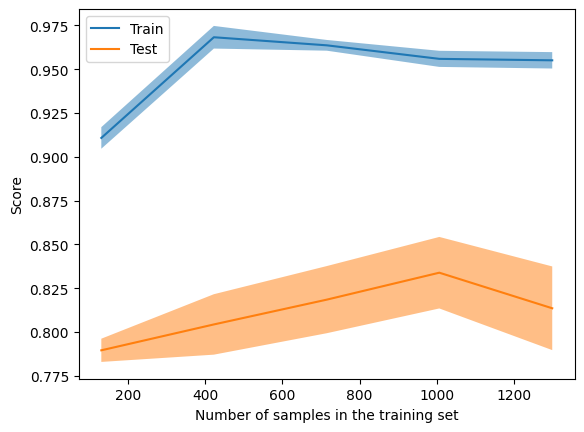
    


It appears the model overfit a bit but not catastrophicly so. The score (accuracy) is in a fairly good range compared to the f1 score.

We will plot the confusion matrix to see what it tells us.


```python
conf_mat_3=confusion_matrix(predic_y_3,test_set_2["quality"].map(lambda x: 1 if x=="good" else 0))
ConfusionMatrixDisplay(conf_mat_2,display_labels=["good","bad"]).plot()
plt.show()
print(f'f1:{f1_score(predic_y_3,test_set_2["quality"].map(lambda x: 1 if x=="good" else 0))}')
print(f'accuracy:{accuracy_score(predic_y_3,test_set_2["quality"].map(lambda x: 1 if x=="good" else 0))}')
```


    

    


    f1:0.5704099821746881
    accuracy:0.8516923076923076


The confusion matrix as well as the f1 and accuracy score on the test set do not seem to correspond, altough the scores are in line with the training's.

## Interpretability with SHAP

We will plot the feature importance of multiple wines to see if a correlation is apparrant.


```python
explainer=shap.Explainer(grid_search_3.best_estimator_,transformed_df)
shap_values=explainer(transformed_df)
```

     99%|===================| 4821/4872 [00:14<00:00]        


```python
figs, ax = plt.subplots(2,2,figsize=(10,5))
plt.sca(ax[0][0])
shap.plots.waterfall(shap_values[7], max_display=20,show=False)
ax[0][0].set_title("good red wine 1")
plt.sca(ax[0][1])
shap.plots.waterfall(shap_values[8], max_display=20,show=False)
ax[0][1].set_title("good red wine 2")
plt.sca(ax[1][0])
shap.plots.waterfall(shap_values[16], max_display=20,show=False)
ax[1][0].set_title("good red wine 3")
plt.sca(ax[1][1])
shap.plots.waterfall(shap_values[9], max_display=20,show=False)
ax[1][1].set_title("bad red wine 1")
plt.subplots_adjust(wspace=1,hspace=1)
figs.set_size_inches(20, 8)
plt.show()
```


    
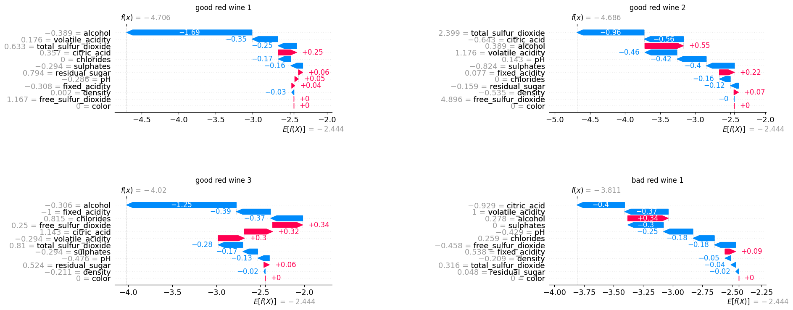
    


```python


for idx,res in enumerate(X_resc_quality["quality"]):
    if res=="good":
        #print(res,Y_color[idx])
        print(f'{idx},{X_resc_quality.iloc[idx]["color"]}')

```

    7,red
    8,red
    16,red
    37,red
    62,red
    128,red
    198,red
    ...
    6475,white
    6485,white
    6486,white
    6495,white


We will now compute the feature importance of the whole set using a tree explainer algorithme.


```python
from shap import TreeExplainer
```


```python
X_qual_encoded=X_resc_quality.drop(["quality","color"],axis=1).join(X_resc_quality["color"].map(lambda x: 1 if x=="red" else 0))
```


```python
treeEx=TreeExplainer(grid_search_3.best_estimator_,transformed_df)
shap_vals=treeEx.shap_values(transformed_df_test)
print(shap_vals)

```

    [[-0.13001664  1.15357634 -0.43148856 ... -0.28844376 -0.54611067
       0.        ]
     [-0.05411492 -0.37361694  0.01049886 ... -0.28342029 -0.32756629
       0.        ]
     [-0.49902472  1.00050191 -0.35434551 ... -0.36987783 -1.25837554
       0.        ]
     ...
     [ 0.07465057 -0.36554291 -0.18316501 ... -0.07869036  0.22763986
       0.        ]
     [ 0.15453541 -0.55301852 -0.57688019 ... -0.08898874 -1.23188121
       0.        ]
     [ 0.15373007 -0.09974648  0.10717064 ... -0.23716786  2.29860654
       0.        ]]


```python
test_set_bad=test_set_2[test_set_2["quality"]=="bad"].drop(["color","quality"],axis=1).join(test_set_2["color"].map(lambda x: 1 if x=="red" else 0))
test_set_good=test_set_2[test_set_2["quality"]=="good"].drop(["color","quality"],axis=1).join(test_set_2["color"].map(lambda x: 1 if x=="red" else 0))
shap_vals_bad=treeEx.shap_values(test_set_bad)
shap_vals_good=treeEx.shap_values(test_set_good)

```


```python
shap_vals_df=pd.DataFrame(shap_vals,columns=list(transformed_df_test))
shap_vals_df_mav=shap_vals_df.abs().mean()
shap_vals_df_mav.plot.bar()
plt.show()
```


    
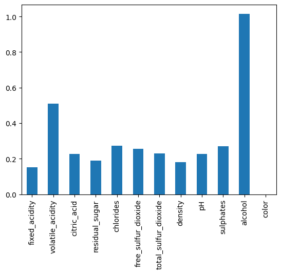
    


We can see clearly which feature are important or not for the whole set. As observed befor, color is irrelevant.


```python
figs, ax = plt.subplots(1,2,figsize=(10,5))
shap_vals_df=pd.DataFrame(shap_vals_bad,columns=list(transformed_df_test))
shap_vals_df_mav=shap_vals_df.abs().mean()
plt.sca(ax[0])
shap_vals_df_mav.plot.bar()
ax[0].set_title("bad wine features importances")
shap_vals_df=pd.DataFrame(shap_vals_good,columns=list(transformed_df_test))
shap_vals_df_mav=shap_vals_df.abs().mean()
plt.sca(ax[1])
shap_vals_df_mav.plot.bar()
ax[1].set_title("good wine features importances")
plt.show()
```


    
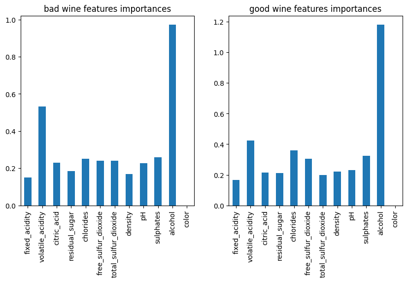
    


We can see the effect acidity has on the classification of a wine between good and bad.


```python
shap.plots.beeswarm(shap_values=shap_values,max_display=20)
```


    
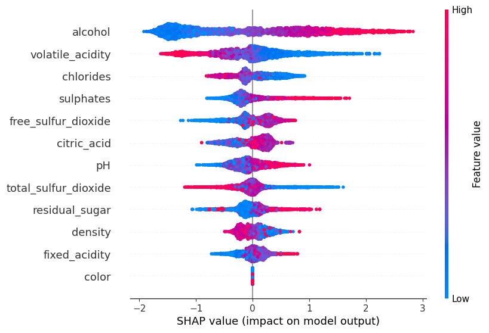
    


Here we have once again the feature importance in a beeswarm plot.


```python
shap.plots.heatmap(shap_values)
```


    
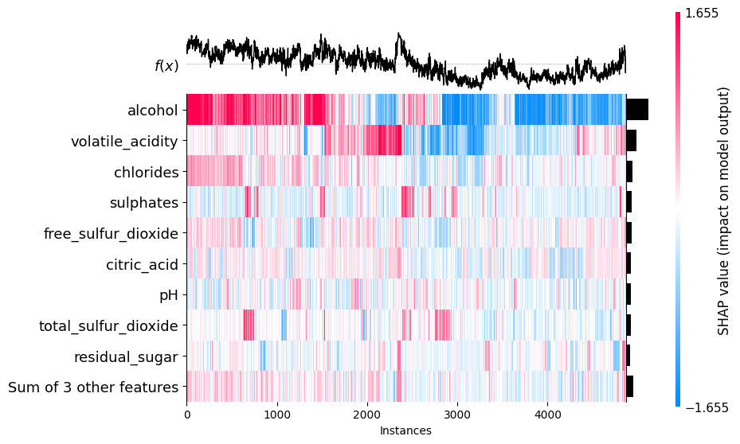
    


    <Axes: xlabel='Instances'>


Here, we can see the importance of each feature for every datapoint in the set.

We will use the partial dependance plot to examine the effect of three of the biggest factors to wine quality, volatile and fixed acidity as well as cictric acid.


```python
shap.partial_dependence_plot(
    "volatile_acidity",
    grid_search_3.best_estimator_.predict,
    X_qual_encoded,
    ice=False,
    model_expected_value=True,
    feature_expected_value=True,
    show=False,
)
shap.partial_dependence_plot(
    "fixed_acidity",
    grid_search_3.best_estimator_.predict,
    X_qual_encoded,
    ice=False,
    model_expected_value=True,
    feature_expected_value=True,
    show=False,
)

shap.partial_dependence_plot(
    "citric_acid",
    grid_search_3.best_estimator_.predict,
    X_qual_encoded,
    ice=False,
    model_expected_value=True,
    feature_expected_value=True,
    show=False,
)
plt.show()
```


    
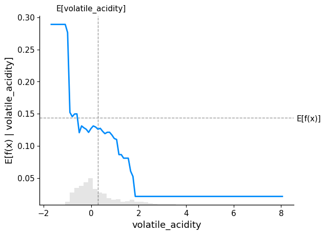
    


    
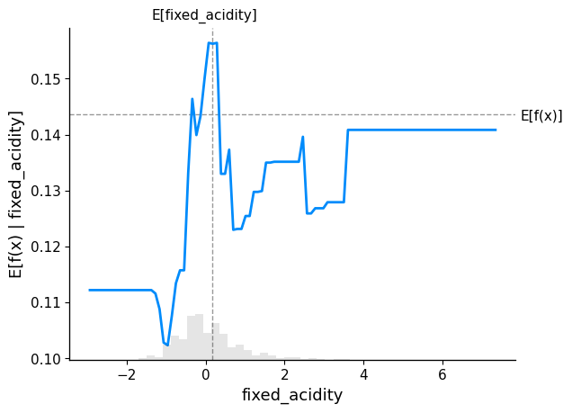
    


    
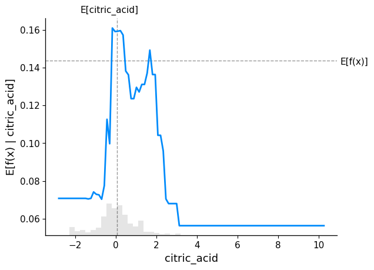
    


We can see here the impact of the different values of acidity in a wine.

### Analyze a few bad wines, and try to see how to make them better


We will now separete the best and worst wines to see if clear differences appear. We use a minmax scaler to set the value of all features between 0 and 1.


```python
from sklearn.preprocessing import MinMaxScaler
minmax_scaler=MinMaxScaler()
minmax_X=pd.DataFrame(minmax_scaler.fit_transform(X.drop("color",axis=1)),columns=list(X)[:-1]).join(X["color"])
```


```python
very_bad_wine=minmax_X[X.join(y)["quality"]==3]
very_bad_wine.head()
```


<div>
<style scoped>
    .dataframe tbody tr th:only-of-type {
        vertical-align: middle;
    }

    .dataframe tbody tr th {
        vertical-align: top;
    }

    .dataframe thead th {
        text-align: right;
    }
</style>
<table border="1" class="dataframe">
  <thead>
    <tr style="text-align: right;">
      <th></th>
      <th>fixed_acidity</th>
      <th>volatile_acidity</th>
      <th>citric_acid</th>
      <th>residual_sugar</th>
      <th>chlorides</th>
      <th>free_sulfur_dioxide</th>
      <th>total_sulfur_dioxide</th>
      <th>density</th>
      <th>pH</th>
      <th>sulphates</th>
      <th>alcohol</th>
      <th>color</th>
    </tr>
  </thead>
  <tbody>
    <tr>
      <th>459</th>
      <td>0.644628</td>
      <td>0.333333</td>
      <td>0.397590</td>
      <td>0.024540</td>
      <td>0.107973</td>
      <td>0.031250</td>
      <td>0.094470</td>
      <td>0.263929</td>
      <td>0.410853</td>
      <td>0.196629</td>
      <td>0.144928</td>
      <td>red</td>
    </tr>
    <tr>
      <th>517</th>
      <td>0.545455</td>
      <td>0.353333</td>
      <td>0.295181</td>
      <td>0.023006</td>
      <td>0.317276</td>
      <td>0.013889</td>
      <td>0.023041</td>
      <td>0.236939</td>
      <td>0.341085</td>
      <td>0.230337</td>
      <td>0.057971</td>
      <td>red</td>
    </tr>
    <tr>
      <th>690</th>
      <td>0.297521</td>
      <td>0.736667</td>
      <td>0.000000</td>
      <td>0.055982</td>
      <td>0.146179</td>
      <td>0.013889</td>
      <td>0.018433</td>
      <td>0.182957</td>
      <td>0.705426</td>
      <td>0.179775</td>
      <td>0.391304</td>
      <td>red</td>
    </tr>
    <tr>
      <th>832</th>
      <td>0.545455</td>
      <td>0.240000</td>
      <td>0.253012</td>
      <td>0.013804</td>
      <td>0.225914</td>
      <td>0.114583</td>
      <td>0.096774</td>
      <td>0.216117</td>
      <td>0.511628</td>
      <td>0.359551</td>
      <td>0.275362</td>
      <td>red</td>
    </tr>
    <tr>
      <th>899</th>
      <td>0.371901</td>
      <td>0.626667</td>
      <td>0.012048</td>
      <td>0.042945</td>
      <td>0.124585</td>
      <td>0.017361</td>
      <td>0.011521</td>
      <td>0.227685</td>
      <td>0.589147</td>
      <td>0.151685</td>
      <td>0.434783</td>
      <td>red</td>
    </tr>
  </tbody>
</table>
</div>


The worst wines have a score of 3.


```python
very_good_wine=minmax_X[X.join(y)["quality"]==9]
very_good_wine.head()
```


<div>
<style scoped>
    .dataframe tbody tr th:only-of-type {
        vertical-align: middle;
    }

    .dataframe tbody tr th {
        vertical-align: top;
    }

    .dataframe thead th {
        text-align: right;
    }
</style>
<table border="1" class="dataframe">
  <thead>
    <tr style="text-align: right;">
      <th></th>
      <th>fixed_acidity</th>
      <th>volatile_acidity</th>
      <th>citric_acid</th>
      <th>residual_sugar</th>
      <th>chlorides</th>
      <th>free_sulfur_dioxide</th>
      <th>total_sulfur_dioxide</th>
      <th>density</th>
      <th>pH</th>
      <th>sulphates</th>
      <th>alcohol</th>
      <th>color</th>
    </tr>
  </thead>
  <tbody>
    <tr>
      <th>2373</th>
      <td>0.438017</td>
      <td>0.126667</td>
      <td>0.271084</td>
      <td>0.153374</td>
      <td>0.043189</td>
      <td>0.093750</td>
      <td>0.271889</td>
      <td>0.190669</td>
      <td>0.372093</td>
      <td>0.134831</td>
      <td>0.347826</td>
      <td>white</td>
    </tr>
    <tr>
      <th>2419</th>
      <td>0.231405</td>
      <td>0.186667</td>
      <td>0.174699</td>
      <td>0.015337</td>
      <td>0.019934</td>
      <td>0.079861</td>
      <td>0.182028</td>
      <td>0.048969</td>
      <td>0.534884</td>
      <td>0.219101</td>
      <td>0.637681</td>
      <td>white</td>
    </tr>
    <tr>
      <th>2426</th>
      <td>0.297521</td>
      <td>0.106667</td>
      <td>0.216867</td>
      <td>0.021472</td>
      <td>0.036545</td>
      <td>0.090278</td>
      <td>0.306452</td>
      <td>0.066320</td>
      <td>0.434109</td>
      <td>0.146067</td>
      <td>0.652174</td>
      <td>white</td>
    </tr>
    <tr>
      <th>2475</th>
      <td>0.256198</td>
      <td>0.186667</td>
      <td>0.204819</td>
      <td>0.055215</td>
      <td>0.014950</td>
      <td>0.194444</td>
      <td>0.260369</td>
      <td>0.051860</td>
      <td>0.434109</td>
      <td>0.078652</td>
      <td>0.681159</td>
      <td>white</td>
    </tr>
    <tr>
      <th>3204</th>
      <td>0.272727</td>
      <td>0.120000</td>
      <td>0.295181</td>
      <td>0.024540</td>
      <td>0.038206</td>
      <td>0.104167</td>
      <td>0.246544</td>
      <td>0.061500</td>
      <td>0.503876</td>
      <td>0.112360</td>
      <td>0.710145</td>
      <td>white</td>
    </tr>
  </tbody>
</table>
</div>


The best wines have a score of 9, but there is only 5 and no red, as such we will take the wine with a score of 8 instead.


```python
very_good_wine=minmax_X[X.join(y)["quality"]==8]
very_good_wine["color"].describe()
```


    count       193
    unique        2
    top       white
    freq        175
    Name: color, dtype: object


```python
best_white_wine=very_good_wine[very_good_wine["color"]=="white"].drop("color",axis=1)
best_red_wine=very_good_wine[very_good_wine["color"]=="red"].drop("color",axis=1)

worst_white_wine=very_bad_wine[very_bad_wine["color"]=="white"].drop("color",axis=1)
worst_red_wine=very_bad_wine[very_bad_wine["color"]=="red"].drop("color",axis=1)
```


```python


"""
best_worst_df=pd.DataFrame({
                            "good_white":pd.DataFrame(minmax_scaler.fit_transform(best_white_wine),columns=list(best_white_wine)).mean(),
                            "good_red":pd.DataFrame(minmax_scaler.fit_transform(best_red_wine),columns=list(best_white_wine)).mean(),
                            "bad_white":pd.DataFrame(minmax_scaler.fit_transform(worst_white_wine),columns=list(best_white_wine)).mean(),
                            "bad_red":pd.DataFrame(minmax_scaler.fit_transform(worst_red_wine),columns=list(best_white_wine)).mean()
                            })"""

best_worst_df=pd.DataFrame({
                            "good_white":best_white_wine.mean(),
                            "good_red":best_red_wine.mean(),
                            "bad_white":worst_white_wine.mean(),
                            "bad_red":worst_red_wine.mean()
                            })
plt.matshow(best_worst_df.transpose(),cmap="RdBu")
plt.xticks(labels=list(best_white_wine),ticks=range(0,11),rotation=45)
plt.yticks(labels=["good_white","good_red","bad_white","bad_red"],ticks=[0,1,2,3])
plt.colorbar()
plt.show()


```


    
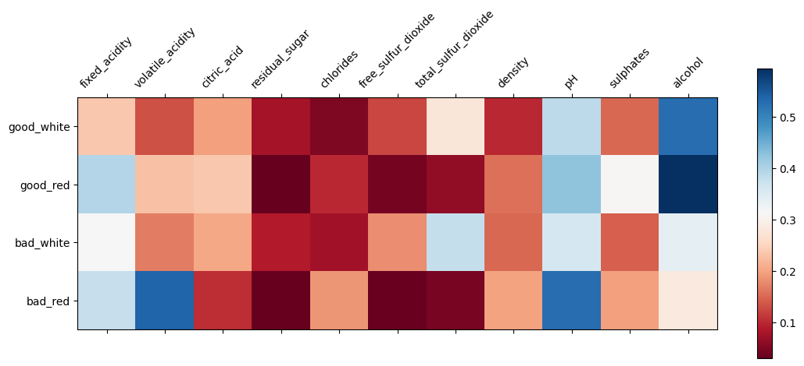
    


Here we can see the mean values of each feature for the good/bad red/white wine. We can see for exemple the importance of alcohol content in good wine amongst other things.

# Wrap-up and conclusion

We have observed that it is possible to segragate the color (white/red) of wine based on chemical properties. Furthermore, it is also possible to determine the quality of a wine even in a mix set of data, altough the results would be better should the colors be separeted, as chemical characteristics varies  fairly strongly depending on it.

For white wine, a higher alcool content, lower density and lower sulfur dioxide concentration seems to indicate a better wine.

Red wine also benefits from higher alcohol content as well as lower volatile acidity and higher citric acid content.

Of course, the sample of very good wine is fairly limited, but these recommendation should nonetheless be solid.

As the set only contains wine wich are drinkable, we also lack the true upper and lower bound for diminishing return, or even regression. For exemple, it is doubtfull a wine with 30% alcohol content would be considered good. As such, indicating lower or upper bounds is not possible.
